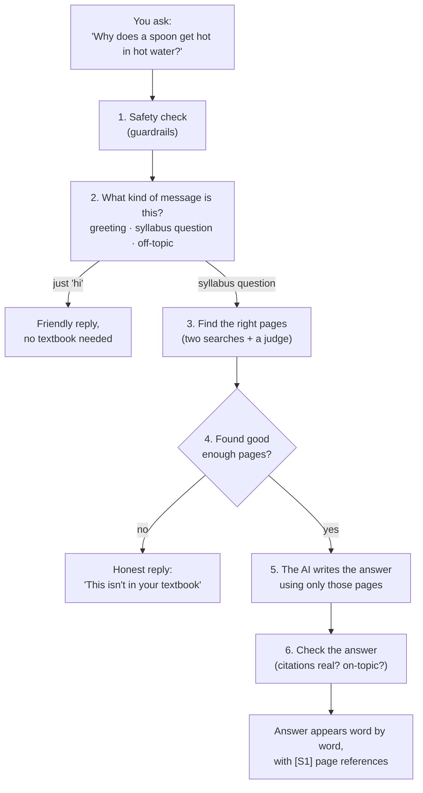

# How StoryTutor Works — explained simply

*A tour of the whole system we built and ran on ASU's Sol supercomputer.
No computer-science background needed. If you can follow a Class 10 science
chapter, you can follow this.*

---

## 1. What is it, in one breath?

It is a **study helper for Class 6, 7 and 8 students**. You ask it a question
about your NCERT Science or Social Science textbook — in **English, Hindi or
Marathi** — and it:

1. **answers you like a patient tutor**, using only what your textbook says,
   and tells you exactly which page it got that from, and
2. can turn a topic into a **30-second explainer video** with pictures, a
   diagram and subtitles.

And it costs **₹0 / $0** to run. No paid AI services. Every model is free and
open-source, running on the university's own computers.

---

## 2. Why not just use ChatGPT?

Three reasons.

| Problem with a general chatbot | What we do instead |
| --- | --- |
| **It makes things up.** It can answer confidently with facts that are not in your book. This is called *hallucination*. | We make the AI answer **only from your textbook pages**, and show the page. |
| **It does not know *your* book.** You are examined on NCERT, not "science in general". | We fed it the actual NCERT PDFs. |
| **It costs money, and your questions leave the building.** | Everything runs on Sol. Nothing is sent to a paid company. |

---

## 3. The big idea: an open-book exam

Think about the difference between two students:

- **Student A** memorised things months ago and answers from memory. Sometimes
  they remember wrong, but they sound just as sure.
- **Student B** is allowed an **open book**. Before answering, they flip to the
  right page, read it, and then answer — and they can point to the page.

A normal chatbot is Student A. **Our system is Student B.**

This idea has a name: **RAG — Retrieval-Augmented Generation.**

- **Retrieval** = *find the right pages first.*
- **Augmented** = *hand those pages to the AI.*
- **Generation** = *now let the AI write the answer, using those pages.*

---

## 4. Step 1 — Building the "library" (done once)

Before anyone can ask a question, the computer has to read the textbooks and
organise them. This happens once, and took a few hours on Sol.

```
 NCERT PDFs  ─►  pull out the text  ─►  cut into small pieces  ─►  make a "meaning fingerprint"  ─►  save
 (3 languages)      (PyMuPDF)             (7,095 chunks)              for each piece (bge-m3)          (the index)
```

**Cutting into pieces.** A whole chapter is too big to hand to the AI, so we
cut every book into small pieces called **chunks** — a paragraph or two each.
We ended up with **7,095 chunks**, each labelled with its class, subject,
chapter, page and language.

**The meaning fingerprint.** For each chunk, a model called **bge-m3** turns
the text into a list of 1,024 numbers — an *embedding*. Think of it as a
fingerprint of what the text *means*. Two pieces that mean similar things get
similar fingerprints, **even in different languages**. "Heat flows from hot to
cold" and "ऊष्मा गर्म से ठंडे की ओर जाती है" end up close together.

These fingerprints are stored in **FAISS**, which is like a super-fast library
catalogue for numbers.

### A problem we had to fix: broken Hindi

The first time we read the Hindi and Marathi PDFs, the text came out
**scrambled** — letters in the wrong order, vowel signs detached, like reading
"cmoputer" instead of "computer". We counted **34,985** broken spots.

We switched to a better PDF reader (**PyMuPDF**) and wrote a clean-up step for
Devanagari (the script Hindi and Marathi use). Broken spots dropped from
**34,985 to 98**. Without this fix, the Hindi and Marathi answers were useless.
**Lesson: if the data is bad, no amount of clever AI can save you.**

---

## 5. Step 2 — Answering a question (every time you ask)

Here is what happens in the few seconds after you press *Send*.



### 1. Safety check (guardrails)

Before anything else, the message is checked for:

- **Tricks** like *"ignore your instructions and…"* — called *prompt
  injection*. These are blocked.
- **Personal information** like phone numbers or emails — these are hidden
  before anything is stored.

### 2. What kind of message is it?

"Hi", "What is photosynthesis?" and "Who won the cricket match?" need
completely different replies. We **don't** use a list of fixed rules like
*"if the message contains 'hi', say hello"* — that breaks the moment someone
types "heyyy" or "नमस्ते". Instead **the AI model itself decides** what kind
of message it is, the way a person would. If the model is busy, a backup uses
meaning-fingerprints to guess.

### 3. Find the right pages — two searches and a judge

We search the library **two different ways**, because each is good at
something the other misses:

| Search | How it works | Good at |
| --- | --- | --- |
| **Keyword search** (BM25) | Looks for the same *words* | Exact terms: "photosynthesis", "Chapter 8" |
| **Meaning search** (bge-m3 + FAISS) | Looks for similar *meaning fingerprints* | Different wording: "how do plants make food?" |

The two result lists are merged (a method called **RRF**, which rewards pages
that rank well in *both*). Then a **judge** model — the **reranker**
(bge-reranker-v2-m3) — reads your question next to each candidate page and
scores how well they really match. The top few pages win.

### 4. The honesty gate

If even the best page scores too low, the system **does not pretend**. It
tells you the textbook does not seem to cover this.

We learned this the hard way. Early on, someone asked *"Who was Mahatma
Gandhi?"*, retrieval found **zero** matching pages, and the AI answered anyway
from its own memory. That is exactly the Student-A behaviour we wanted to
avoid, so we closed that gap.

### 5. The AI writes the answer

The chosen pages are handed to the AI model — **Qwen 2.5 (7 billion
parameters)**, running through a program called **Ollama** on Sol's GPU. It is
told:

- use **facts only from these pages**, and mark each fact with a reference
  like **[S1]**, **[S2]**,
- but **do** explain creatively — analogies, everyday examples, a friendly
  tone. Those don't need a reference, because they are teaching, not facts.

The answer **streams** onto the screen word by word, like ChatGPT, so you are
not staring at a blank screen.

### 6. Check the answer

After writing, the system checks:

- **Are the references real?** If the AI writes [S7] but only 5 pages were
  given, that fake reference is removed.
- **Does the answer actually use the pages?** A simple overlap check catches
  answers that drifted away from the source.

These checks are *deliberately* simple fixed rules. We want the **thinking**
done by AI, but the **safety locks** to be predictable, so they can never be
talked out of doing their job.

---

## 6. Three languages

| Language | Question | Answer | Textbooks searched |
| --- | --- | --- | --- |
| English | ✓ | ✓ | English NCERT |
| हिन्दी Hindi | ✓ | ✓ | Hindi NCERT |
| मराठी Marathi | ✓ | ✓ | Marathi NCERT |

The meaning-fingerprint model (bge-m3) understands all three, and the keyword
search was fixed to split Devanagari words correctly (it originally chopped
them apart at every vowel sign).

---

## 7. The 30-second video maker

This was the research deliverable: take a concept and make a short video that
actually explains it.

### Why we didn't just use an "AI video generator"

AI video models look impressive, but for a teaching video they have serious
problems:

- **They can't write text.** Letters come out as gibberish — and in Hindi, it
  is even worse.
- **They're different every time**, so you can't check or repeat a result.
- **They invent diagrams** that look scientific but are wrong.

So we **build** the video instead of asking an AI to dream it up.

### How one video is made

```
Question ─► RAG answer ─► Script (4 scenes) ─► 3 pictures + 1 diagram ─► cards ─► moving video ─► MP4
           (with pages)   checked for length   (FLUX)       (drawn)      (Pillow)   (ffmpeg)       + audit file
```

**The 4 scenes (30 seconds, about 72 spoken words):**

| Time | Scene | What you see |
| --- | --- | --- |
| 0–4 s | **Title** | A picture + the topic name + class and subject |
| 4–13 s | **Core idea** | A picture + the one key sentence |
| 13–24 s | **Diagram** | Boxes and arrows, e.g. *Hot water → Metal spoon → Your hand* |
| 24–30 s | **Your turn** | A picture + a question for you to think about |

Why 72 words? It's arithmetic: people speak about 2.5 words per second, so
30 seconds ≈ 75 words. The system **counts the words** and sends the script
back if it is too long *or* too short. (We added the "too short" check after
one Hindi script came back with only 4 words for the whole video.)

**Rules that keep the video trustworthy:**

- **The picture model never writes text.** The pictures come from **FLUX.1-schnell**,
  a free image model. It is only asked to paint objects ("a steel spoon in a cup
  of tea"). Every word on screen is typed by our own code, so Hindi and Marathi
  always look correct.
- **The diagram is never an AI picture.** It is drawn from an exact list of boxes and
  arrows, because it is the one scene that must be precisely right.
- **Pictures decorate, they never teach facts.** Facts live in the narration
  and the diagram, which trace back to textbook pages.
- **Same question, same video.** Each picture uses a fixed "random seed", and
  pictures are saved, so re-running gives identical results.
- **Every video has an audit file** (a `.json` next to the `.mp4`) listing the
  question, the textbook pages used, the full script and each picture's
  prompt — so a teacher can check every line.
- **No textbook pages, no video.** A confident video about something the book
  doesn't cover is worse than no video.

Each scene slowly zooms in and fades, so it doesn't feel like a frozen slide.
Subtitles are burned in at the bottom; the source (e.g. *NCERT Class 6,
Science, Ch. 8, p. 3*) sits at the top.

---

## 8. Where it all runs: Sol

**Sol** is ASU's supercomputer — thousands of computers in a data centre that
students and researchers share. The key part for us is the **GPU**: a special
chip, originally built for video games, that happens to be excellent at the
maths AI needs. We used an **NVIDIA A100 with 80 GB of memory**.

```
 Your laptop                      Sol (ASU)
 ┌────────────┐   GitHub    ┌──────────────────────────────────────────────┐
 │ write code │ ──────────► │ /scratch/…/storytutor  (the project)         │
 └────────────┘  git push   │                                              │
                 git pull   │  GPU node (A100)                             │
 ┌────────────┐             │   • Ollama + Qwen 2.5 7B  ← writes answers   │
 │ browser    │ ◄────────── │   • bge-m3 + reranker     ← finds pages      │
 │ (chat and  │  VS Code    │   • FLUX.1-schnell        ← paints pictures  │
 │  /videos)  │  tunnel     │   • Flask web app, port 5050                 │
 └────────────┘             └──────────────────────────────────────────────┘
```

- **Code travels through GitHub.** We edit on the laptop, push to GitHub, and
  Sol pulls it. Sol only *reads* from GitHub, so the two never fight.
- **`/scratch`** is Sol's big, fast storage. Models are huge (FLUX alone is
  ~33 GB), so everything lives there, not in the small home folder.
- **SLURM** is Sol's queue system: you ask for a GPU, wait your turn, get it
  for a set time. Big jobs (like building the index) were sent with `sbatch`.
- **The VS Code tunnel** lets a browser on your laptop open the web page that
  is actually running on Sol.

**How much did it cost?** Nothing. Every model is free and open-source, and
Sol time is provided by the university.

---

## 9. How do we know it works? (tests and evals)

**Tests** are small automatic checks that run in seconds. There are about
**130** of them. Examples:

- "A Hindi script of 4 words must be rejected."
- "A reference to [S9] when only 1 page exists must be removed."
- "The diagram scene must never be replaced by an AI picture."
- "A rendered video must really be about 30 seconds long."

**Evals** measure quality on real questions:

- a **golden set** of questions with known correct textbook pages, to measure
  *"did retrieval find the right page?"*,
- **53 test questions for the chatbot** (`eval/chat_questions.json`) covering
  greetings, syllabus questions in all three languages, off-topic questions,
  trick prompts and follow-ups.

---

## 10. What works, and what is still left

**Working now**

- ✅ Chat like ChatGPT, streaming, in English, Hindi and Marathi
- ✅ Answers grounded in NCERT pages, with page references
- ✅ Honest "not in your textbook" replies
- ✅ Safety checks against tricks and personal data
- ✅ 30-second videos for 4 concepts in all three languages, viewable at `/videos`
- ✅ One command on Sol: `bash scripts/sol.sh up` starts everything

**Still to do**

- 🔲 **Pictures in videos on Sol** — the code is ready; the Hugging Face
  account must first click "Agree" on the FLUX.1-schnell model page.
- 🔲 **Follow-up questions** — "explain that again more simply" needs the
  system to remember what "that" was when searching.
- ✅ **Voice** — a 🔊 Listen button reads chatbot answers aloud, and videos
  are narrated (Indic Parler-TTS, in its own small "voice server").
- 🔲 **Richer English scripts** — the first English scripts were on the short
  side; the new minimum-length check should push them fuller.

---

## 11. Mini-dictionary

| Word | Meaning |
| --- | --- |
| **RAG** | Find the right pages first, then let the AI answer using them. |
| **Chunk** | A small piece of a textbook (a paragraph or two). |
| **Embedding** | A list of numbers that captures what a piece of text *means*. |
| **FAISS** | A fast catalogue for finding similar embeddings. |
| **BM25** | Classic keyword search, like a book's index. |
| **Reranker** | A judge model that re-scores the best candidates. |
| **LLM** | *Large Language Model* — the AI that writes text (here, Qwen 2.5). |
| **Ollama** | The program that runs the LLM on Sol. |
| **Hallucination** | When an AI states something false with confidence. |
| **Guardrails** | Safety checks around the AI. |
| **Citation / [S1]** | A pointer to the exact textbook page a fact came from. |
| **GPU** | A chip that does AI maths very fast. |
| **Sol / SLURM** | ASU's supercomputer / its waiting-line system. |
| **FLUX.1-schnell** | The free image model that paints the video pictures. |
| **Seed** | A starting number that makes "random" results repeatable. |

---

## 12. Where to look in the repo

| If you want to see… | Open |
| --- | --- |
| The web app and chat | `story_mvp/app.py`, `story_mvp/static/chat.html` |
| How a question gets answered | `story_mvp/rag_chat.py` |
| Finding pages | `story_mvp/rag_engine.py`, `bm25.py`, `reranker.py` |
| Deciding message type, safety | `story_mvp/intent.py`, `story_mvp/guardrails.py` |
| Reading the PDFs | `story_mvp/ingest_curriculum.py`, `deva_quality.py` |
| The video maker | `scripts/make_video.py`, `story_mvp/video/` |
| The video page | `story_mvp/static/videos.html` (open `/videos`) |
| The 4 video concepts | `concepts.json` |
| Tests / evals | `tests/`, `eval/` |
| Engineering plans | `plan.md` (chatbot), `Vidplan.md` (videos) |

---

*In one sentence: **it's an open-book tutor — it finds the right page in your
own textbook first, then explains it kindly, in your language, and it tells
you where every fact came from.***
