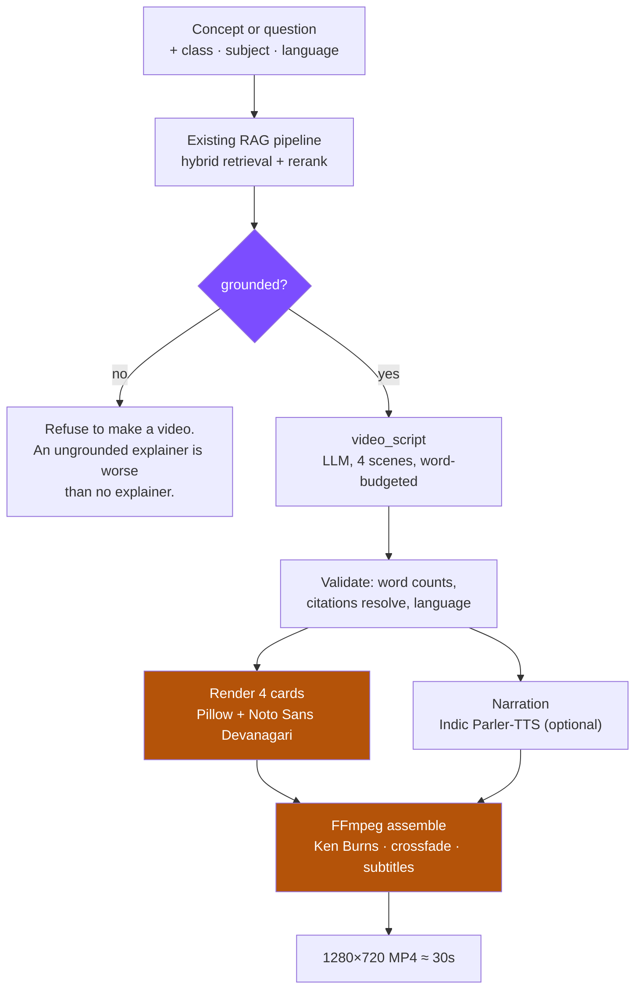

# Vidplan.md — 30-second concept videos from the RAG answer

**Goal:** turn a grounded RAG answer into a short explainer video — accurate,
reproducible, in English, Hindi or Marathi — for **3–4 concepts** as the
research deliverable.

**Constraint:** same as the rest of the project. Open models only, no paid APIs,
$0, and every factual line traceable to an NCERT page.

**Date:** 2026-09-24 · companion to `plan.md`, which covers the chatbot.

---

## 1. The central decision: render, don't generate

The obvious approach is a text-to-video diffusion model. It is the wrong tool
here, for three concrete reasons:

| | Diffusion (Wan, CogVideoX, LTX) | Deterministic render |
| --- | --- | --- |
| Text on screen | **mangles it** — the text *is* the payload in an explainer | exact |
| Reproducibility | different every run | **identical every run** |
| Diagram accuracy | invents plausible-looking nonsense | drawn from a spec |
| Cost | 20+ GB download, GPU minutes per clip | seconds, mostly CPU |
| Defensible in a paper | "we generated something" | "we rendered this spec" |

For a research artifact you have to defend, *"same input produces the same
video"* is worth more than visual flair. So: **Pillow draws the frames,
FFmpeg assembles them.** No image model, no video model.

### And no external binaries either

`graphviz` and a system `ffmpeg` both need cluster modules that may not exist.
Every dependency that has failed on Sol so far has been an install problem, not
a code problem. So:

- diagrams are drawn **directly in Pillow** (boxes and arrows), not Graphviz
- encoding uses **`imageio-ffmpeg`**, which ships a static ffmpeg binary as a
  pip wheel — no `module load`, no system package

The only thing that genuinely needs the GPU is TTS, and even that is optional.

---

## 2. Pipeline



**The grounding gate is not optional.** If retrieval found nothing, the system
refuses to make a video rather than producing a polished, confident, wrong one.
A video is more persuasive than text and therefore more dangerous when wrong.

---

## 3. Scene structure

| # | Time | Card | Narration budget |
| --- | --- | --- | --- |
| 1 | 0–4 s | Title + class/subject badge | ≤ 10 words |
| 2 | 4–13 s | The core idea, one sentence, large | ≤ 22 words |
| 3 | 13–24 s | Concept diagram — boxes and arrows | ≤ 26 words |
| 4 | 24–30 s | Check question + source line | ≤ 14 words |

**≈ 72 words total.** This is arithmetic, not style: narration runs about
2.5 words/second in English and 2.2 in Hindi/Marathi, so 30 seconds *is*
70–80 words. The current `narration_script` splices `story[:280]` — roughly 45
words for a single scene — which would produce a 60-second video. The budget is
validated programmatically; over-long narration is regenerated, not trusted.

**Every video carries its source on screen**, e.g. *NCERT Class 6 Science,
Ch. 8, p. 3*. That is the accuracy claim made visible.

---

## 4. Dependencies

| Need | Choice | Licence | Why |
| --- | --- | --- | --- |
| Frames | **Pillow** | MIT-CMU | already a transitive dep |
| Font | **Noto Sans Devanagari** | SIL OFL 1.1 | without it Hindi/Marathi render as tofu |
| Encode | **imageio-ffmpeg** | BSD-2 | bundles a static ffmpeg; no module load |
| TTS | **`ai4bharat/indic-parler-tts`** | Apache-2.0 | Hindi + Marathi + Indian English in one model |
| Script | qwen2.5:7b / qwen3:8b via Ollama | Apache-2.0 | already running |

**Deliberately not used:** Graphviz (external binary), FLUX/SDXL (24 GB,
non-reproducible, can't render text), any text-to-video model.

### The Devanagari trap

Pillow needs **libraqm** for complex-script shaping. Without it, conjuncts and
matras render in the wrong order even with the correct font loaded — the text
looks *almost* right, which is worse than obviously broken.

`PIL.features.check('raqm')` must return True. Recent Linux Pillow wheels bundle
it. The renderer checks at startup and refuses to render Devanagari without it,
rather than silently producing malformed text.

---

## 5. Accuracy

This is the part that matters for a research deliverable.

1. **Content comes from the RAG pipeline**, not from the model's memory. Same
   retrieval, same reranker, same evidence gate as the chatbot.
2. **No sources → no video.** Hard refusal.
3. **Citations are validated** before rendering — a `[S2]` with only one source
   fails the build rather than reaching the screen.
4. **The source is shown on screen** in scene 4, so a viewer can check it.
5. **Word budgets are enforced**, not requested.
6. **Deterministic**: same question, same corpus, same index → byte-identical
   frames. The only variable is the LLM script, which is logged alongside the
   video.

Each video writes a sidecar `.json` with the question, retrieved sources with
scores, the generated script, and the model used. That is the audit trail.

---

## 6. Repo layout

```
story_mvp/video/
    __init__.py
    script.py      # RAG answer -> validated 4-scene script
    cards.py       # Pillow rendering: title, idea, diagram, check
    tts.py         # Indic Parler-TTS, optional and degradable
    render.py      # frames + audio -> MP4 via imageio-ffmpeg
scripts/
    make_video.py  # CLI: one concept, or a batch of 3-4
tests/
    test_video.py  # script validation, word budgets, card rendering
outputs/videos/    # gitignored: mp4 + sidecar json
```

The chatbot is untouched. Video reuses its retrieval and its LLM client rather
than duplicating either.

---

## 7. Phases

### A — Script generation *(no rendering yet)*
`video_script.py`: RAG answer → 4 scenes with word budgets, a diagram spec
(nodes + edges), and a source line. Validated: budgets, citation resolution,
language match. **Exit:** valid script JSON for 3 concepts in 3 languages.

### B — Cards
Pillow rendering with Noto Sans Devanagari and a raqm check. Title, idea,
diagram, check.
**Exit:** 4 PNGs per concept, correct Devanagari verified by eye in all three
languages.

### C — Assembly
imageio-ffmpeg: still frames → timed video, Ken Burns drift, crossfades, burned
subtitles. Silent if TTS is unavailable.
**Exit:** a 28–32 s MP4 that plays.

### D — Narration
Indic Parler-TTS per scene; real audio duration drives scene length rather than
the estimate.
**Exit:** narrated video, audio aligned within 0.5 s.

### E — Batch + endpoint
`make_video.py --batch` for the 3–4 research concepts, and `POST /api/video`
so the chat UI can offer "explain this as a video".

---

## 8. Run

```bash
cd $PROJ && git pull
pip install imageio-ffmpeg          # static ffmpeg, no module needed

# one video
python scripts/make_video.py \
  --question "Why does a spoon get hot in hot water?" \
  --class-level 6 --subject science --language english

# the research batch
python scripts/make_video.py --batch concepts.json
```

Requires Ollama running, as the chatbot does.

---

## 9. Risks

| Risk | Mitigation |
| --- | --- |
| Pillow lacks raqm → malformed Devanagari | checked at startup, refuses rather than renders wrong |
| TTS install (parler-tts is a git install) | optional; silent video with burned subtitles still works |
| Narration overruns 30 s | budgets validated in code, regenerated on overflow |
| 7B model writes an ungrounded script | same evidence gate as the chatbot; no sources → no video |
| ffmpeg missing on the node | imageio-ffmpeg ships its own binary |
| Font missing | downloaded once into /scratch, path recorded |

---

## 10. Definition of done

1. **3–4 concept videos**, at least one Hindi and one Marathi.
2. Each 28–32 s, 1280×720, correct Devanagari on screen.
3. Each shows its NCERT source, and has a sidecar JSON with retrieved sources
   and scores.
4. Re-running the same concept produces the same video.
5. A concept with no retrieved sources is **refused**, not faked.
6. Zero paid APIs; every model Apache-2.0/MIT/OFL.
