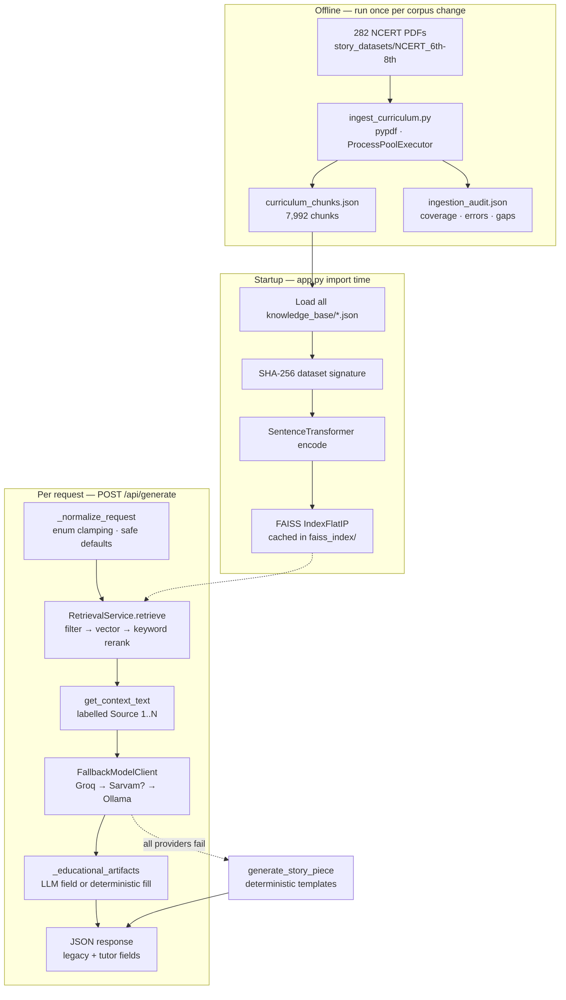

# Concept — StoryTutor-MM

The thinking behind the system: what problem it solves, why it is built the way
it is, and which trade-offs were deliberate.

---

## 1. The problem

Indian middle-school learners (Class 6–8) study Science and Social Science from
NCERT textbooks that exist in English, Hindi, and Marathi. Two things go wrong:

1. **Comprehension.** Textbook prose states facts; it rarely makes them
   memorable. Misconceptions ("a moving object needs a continuous forward
   force") survive the reading because nothing confronts them.
2. **Access.** Tutoring that fixes this is expensive, English-biased, and
   unavailable at the moment a learner is stuck.

Generic LLM tutoring solves neither cleanly: it hallucinates textbook facts, it
does not know which chapter the learner is actually on, and its quality collapses
outside English.

---

## 2. The product idea

> **Ground a story in the learner's own textbook page, in the learner's own
> language, and hand back everything a teacher would need to teach it.**

One request in — a learning goal plus class, subject, chapter, and language —
and one bundle out:

| Artifact | Pedagogical job |
| --- | --- |
| `learning_objective` | Name the goal explicitly so the session has a target |
| `explanation` | State the concept plainly, grounded in retrieved text |
| `story` | Make it memorable through narrative, characters, and a turn |
| `quiz` | Check understanding immediately |
| `storyboard` | Sequence goal → story → diagram → check, scene by scene |
| `diagram_plan` | Give the visual channel a concrete node/edge spec |
| `narration_script` | Make it recordable as audio |
| `video_demo_plan` | Assemble the above into something renderable |
| `retrieved_sources` | Citations, so a teacher can verify against the book |

The name encodes the ambition: **Story** (narrative pedagogy) **Tutor**
(instruction, not entertainment) **-MM** (multilingual and multimodal).

---

## 3. Design principles

### 3.1 Free-first

Every default path costs nothing. Groq's free tier is preferred, Ollama runs
entirely local, Sarvam is opt-in behind `STORYTUTOR_ENABLE_SARVAM` and off by
default, and embeddings are open-weights sentence-transformers.

The principle extends to the multimodal output. The system never calls a paid
image, video, or TTS API. It emits *plans* — a storyboard, a diagram spec, a
narration script, an asset list, and `recommended_free_tools`
(`ffmpeg`, `moviepy`, HTML/SVG, browser screenshots). `video_demo_plan.renderable_without_paid_api`
is the flag that asserts this contract. Rendering is left as a downstream step
the user owns.

**Why:** an MVP for Indian classrooms that requires per-request paid inference is
not deployable at the scale it needs to matter.

### 3.2 The response contract is frozen

The project began as a Kuku FM-style story generator. Its API returned `output`,
`pitch`, `story_bible`, `style_notes`, `safety`. The pivot to tutoring **added**
fields and removed none.

That constraint is enforced, not merely stated: `test_ai_and_fallback_produce_same_shape`
asserts the AI and fallback paths return an identical key set. Any frontend
written against the old shape still works.

**Why:** a stable contract lets the internals be rewritten — deterministic →
RAG+LLM → future agent graph — without a frontend rewrite each time.

### 3.3 Graceful degradation, never a hard failure

Failure is absorbed at four independent levels:

```
1. Provider chain     Groq → [Sarvam] → Ollama          FallbackModelClient
2. LLM path           any LLM failure → deterministic    generate_story_piece_ai
3. Startup            RAG init failure → AI_ENABLED=False    app.py import
4. Network            backend unreachable → client-side templates    story.js
```

Level 4 is the reason [demo.html](story_mvp/demo.html) exists: the demo runs from
a file:// URL with no Python installed at all. A demo that fails in front of an
audience is worse than a demo that degrades quietly, and `/api/health` reports
honestly which tier actually served.

**Cost of this principle:** silent degradation is easy to miss. The deterministic
prose is confident, well-formed, and pedagogically hollow. `model_provider` in
the response is the only signal — the UI should surface it more loudly than it
currently does.

### 3.4 Curriculum grounding over model knowledge

The system prompt in `build_tutor_system_prompt()` is explicit:

> *"Use the retrieved sources as grounding. Do not invent textbook facts if the
> context is insufficient; say what needs verification."*

Retrieval is not decoration. Filters narrow to the learner's class, subject, and
language before the model ever sees text, and `retrieved_sources` returns page
numbers and source filenames so a teacher can check the claim against the book.

---

## 4. Architecture



### Module responsibilities

| Module | Role |
| --- | --- |
| [app.py](story_mvp/app.py) | Flask routes, boot-time wiring, engine selection |
| [generator.py](story_mvp/generator.py) | Request normalization, orchestration, deterministic engine, artifact assembly |
| [rag_engine.py](story_mvp/rag_engine.py) | `StoryRAG` index + retrieval; `RetrievalService` educational subclass |
| [llm_client.py](story_mvp/llm_client.py) | Thin `StoryLLM` compatibility shim over the provider chain |
| [model_clients.py](story_mvp/model_clients.py) | Provider adapters, prompt construction, JSON parsing |
| [ingest_curriculum.py](story_mvp/ingest_curriculum.py) | Offline PDF → chunk pipeline with audit |
| [static/story.js](story_mvp/static/story.js) | UI state, API calls, client-side fallback generator |

`generator.py` is the load-bearing module: it owns the request contract, the
response contract, both engines, and the field-by-field merge between them.

---

## 5. The retrieval concept

Three ideas make retrieval work over a corpus that is mostly non-English:

### 5.1 Hybrid scoring

```python
score = 0.85 * cosine_similarity + 0.15 * keyword_overlap
```

Dense embeddings carry meaning; the lexical term rescues exact technical
vocabulary — *photosynthesis*, *प्रकाश संश्लेषण* — which dense vectors can blur
against neighbouring concepts. The 85/15 weighting keeps semantics dominant while
letting an exact term break a near-tie.

### 5.2 Filter negotiation

`_supported_filters()` is the subtle idea. A learner types a chapter as
"plants"; the corpus labels it `"101"` because that is what the NCERT filename
encodes. A naive `AND` filter returns nothing.

So a filter is only applied if **some document in the corpus actually carries
that value**. Unrepresentable filters are dropped — the learner's words still
steer the *query*, but they cannot silently zero out the result set. Class,
subject, and language do exist in the metadata, so those filters always bind,
which `test_retrieve_never_relaxes_requested_class_or_subject_filters` locks in.

There is a matching correctness detail in `retrieve()`: FAISS `IndexFlat` has no
metadata predicates, so when filters are active the search fetches **all**
candidates before filtering. Otherwise a correct-but-lower-ranked chunk could be
cut by the top-k window before the filter ever saw it.

### 5.3 Language fallback with disclosure

`RetrievalService` overrides `retrieve()` with one educational rule: search the
learner's language first; if Hindi or Marathi yields fewer than `top_k` results,
back-fill from English. Back-filled documents are tagged
`retrieval_language_fallback: "english"`.

**Why it matters:** thin native-language coverage should degrade into *partial
grounding*, not *no grounding*. Tagging keeps it honest rather than invisible.

---

## 6. Data model

### Chunk schema (one per ~1,800 characters of a textbook page)

```json
{
  "id": "6_science_marathi_fmrcu101_p3_c1",
  "language": "marathi", "class_level": "6", "subject": "science",
  "chapter": "101", "topic": "",
  "chunk_type": "curriculum_page",
  "page_start": 3, "page_end": 3,
  "source_file": "…/fmrcu101.pdf",
  "text": "…",
  "tags": ["science", "marathi", "class-6"],
  "metadata": { "class_level": "6", "…": "…" },
  "mode": "expand", "genre": "thriller", "tone": "cinematic"
}
```

Two things to understand here:

- **Metadata is duplicated** at the top level and under `metadata`. Every reader
  in `rag_engine.py` uses the `doc.get(k) or doc.get("metadata", {}).get(k)`
  pattern, which lets curriculum chunks and the hand-written
  `knowledge_base/*.json` seed files (which nest differently) share one index.
- **`mode`/`genre`/`tone` are vestigial** on curriculum chunks — every chunk is
  hardcoded to `expand`/`thriller`/`cinematic`. They exist because
  `test_each_document_has_required_fields` requires `mode` and `genre`, and
  because `retrieve()` still accepts those filters. `retrieve()` guards against
  the damage by only applying a mode/genre filter when some document genuinely
  varies on it.

### The knowledge base is two-layered

| Layer | Files | Role |
| --- | --- | --- |
| Pedagogical seed | `curriculum/`, `examples/`, `misconceptions/`, `science/curriculum/` | ~12 hand-written docs encoding *how to teach*: learning objectives, teaching moves, named misconceptions with corrections |
| Curriculum corpus | `processed/curriculum_chunks.json` | 7,992 machine-extracted docs encoding *what to teach* |

Both go into one FAISS index. A retrieval can therefore surface a textbook page
and a "common misconception: energy disappears when an object stops moving →
trace where the energy went" card in the same context block. That combination is
the pedagogical core of the design.

---

## 7. The model contract

`build_tutor_system_prompt()` does four things at once:

1. **Role and audience** — a free-first multilingual tutor for Class 6–8.
2. **Target parameters** — language, class, subject, tone, length, output type,
   injected as explicit constraints.
3. **Grounding block** — retrieved sources delimited by `---`, with the
   don't-invent-facts instruction.
4. **Output schema** — the full JSON shape, inline, as the response format.

Reliability is layered rather than trusted:

- Groq is called with `response_format={"type": "json_object"}`; Ollama with
  `"format": "json"` — provider-level JSON enforcement where available.
- `parse_json_response()` retries by extracting a fenced ```json block when a raw
  parse fails.
- `_educational_artifacts()` merges field by field with `or` fallbacks, so a
  model that returns eight of eleven fields still produces a complete response
  with deterministic fills for the rest.

A partially-compliant model degrades to partial output, not an error.

---

## 8. Deliberate trade-offs

| Choice | Bought | Paid |
| --- | --- | --- |
| `IndexFlatIP` (exhaustive search) | Exact recall, zero tuning, trivial rebuild | O(n) per query; won't scale past ~10⁵ chunks |
| Build index at import time | Zero-config startup, no separate build step | Long, silent cold start; no readiness signal |
| Path-based PDF metadata | No OCR, no LLM labelling, no cost | Folder naming is now a load-bearing contract |
| Fixed-size character chunking | Simple, language-agnostic, works for Devanagari | Splits mid-sentence and mid-table; ignores headings |
| Frozen response contract | Free internal rewrites, no frontend churn | Story-genre vestiges persist in a tutoring product |
| Silent degradation everywhere | Demo never fails | Quality drops can go unnoticed |
| PDFs committed to git | Reproducible corpus, one-clone setup | ~3.5 GB repository |

---

## 9. Known conceptual gaps

- **Two engines, one product identity.** The deterministic engine still writes
  thriller prose about locked phones and floorboards, and the client-side
  fallback in `story.js` does the same. Under degradation the product silently
  becomes the story generator it used to be, not a tutor.
- **The frontend under-renders the backend.** The API returns a full storyboard,
  diagram plan, quiz, narration script, and citations; `renderTutorExtras()`
  reduces all of it to a handful of `<li>` summary lines. Most of the
  pedagogical value never reaches the screen.
- **`output_type` and `difficulty` are transported, not honoured.** Both reach
  the prompt, but no branch in `generator.py` shapes the response differently for
  `quiz` vs `video_demo_plan`, and difficulty affects nothing deterministic.
- **No learner model.** Every request is stateless. There is no memory of what a
  learner got wrong, so there is no adaptation — which is what "adaptive learning
  story" in the README promises.
- **Safety is a placeholder.** Three substring checks, self-documented as such.
- **No evaluation harness.** Tests assert response *shape*, never whether an
  explanation is factually grounded in the sources it cites. Groundedness is the
  central claim of the product and the one thing nothing measures.

---

## 10. Where the concept goes next

The README's stated direction — hybrid RAG, LangGraph agents, learner memory,
MCP servers, multimodal generation, assessment — maps onto the gaps above in a
natural order:

1. **Render what already exists.** Storyboard, quiz, diagram, and citations
   deserve real UI. Highest value per unit of work; no backend change needed.
2. **Make `output_type` real.** Branch the response so a `quiz` request returns a
   quiz-shaped artifact, not a story with a quiz attached.
3. **Add a groundedness eval.** A held-out set of curriculum questions plus a
   citation-support check — the missing measurement.
4. **Retire the story-genre vestiges.** Replace the deterministic thriller
   templates with pedagogically honest ones, and drop `mode`/`genre`/`tone` from
   the chunk schema.
5. **Introduce learner memory.** Store quiz outcomes per learner; feed the miss
   history into retrieval filters and prompt context. This is the step that turns
   a generator into a tutor.
6. **Then scale infrastructure.** IVF/HNSW indexing, a pre-built index artifact,
   a real server, and actual rendering of the video plans.
