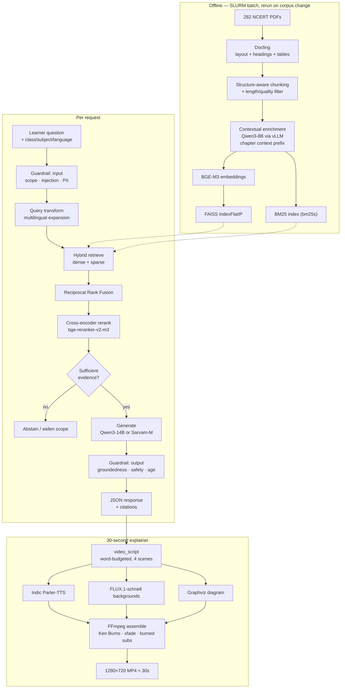

# plan.md — StoryTutor-MM on ASU Sol

**Target:** a fully open-source, GPU-accelerated, curriculum-grounded RAG tutor that
answers a Class 6–8 Science/Social-Science question from NCERT source text in
English, Hindi, or Marathi — evaluated, guardrailed, and rendered as a 30-second
explainer video.

**Status:** plan of record. Supersedes `GPU_HANDOFF_PROMPT.md` (which covered only
lift-and-shift). Read `concept.md` for why the system is shaped the way it is.

**Hard constraint:** every model is OSI-open (Apache-2.0 / MIT) or explicitly
noted. No paid APIs anywhere in the runtime path.

**Date:** 2026-09-21

---

## 0. Where we are

| Dimension | Today | After this plan |
| --- | --- | --- |
| Extraction | `pypdf` raw text, no structure | Docling → headings, tables, reading order |
| Chunking | Fixed 1,800 chars / 250 overlap; **min chunk = 3 chars** | Structure-aware + contextual prefix, length-filtered |
| Retrieval | Dense-only FAISS + ad-hoc `0.85·cos + 0.15·overlap` | BGE-M3 dense + BM25 sparse → RRF → cross-encoder rerank |
| Reranking | None | `bge-reranker-v2-m3` |
| Generation | Groq API / tiny Ollama model | vLLM serving Qwen3 / Sarvam-M locally |
| Evals | Shape assertions only | Golden set from NCERT exercises + RAGAS + retrieval metrics |
| Guardrails | 3 substring checks | 4-layer: input, retrieval, output, child-safety |
| Video | A JSON *plan*, nothing rendered | Rendered 1280×720 MP4 with Indic TTS + subtitles |
| Compute | CPU laptop | Sol A100, SLURM batch |

**Corpus baseline (measured):** 282 PDFs → 7,992 chunks, 9.9 M chars ≈ 3.1 M tokens.
By language: Hindi 3,014 / English 2,724 / Marathi 2,254. 282 distinct chapters.
**691 chunks contain chapter-end exercise markers** — this is the seed for the eval set.

---

## 1. Principles

1. **Open weights only.** Apache-2.0 or MIT preferred; anything else is called out
   in §3 and needs a licence decision before it ships.
2. **The API contract stays frozen.** `/api/generate` keys are additive-only.
   `tests/test_ai_integration.py` asserts AI and fallback return identical key sets.
3. **Nothing heavy runs at import time.** Index building moves to SLURM batch jobs.
4. **The interactive tunnel is for editing, not computing.** 4-hour queued windows
   are too fragile for multi-hour jobs — use `sbatch`.
5. **Deterministic beats generative where legibility matters.** Diagrams and
   on-screen text are rendered by Graphviz/Pillow, not by a diffusion model.
6. **Every claim is cited.** If the retrieved context doesn't support it, the system
   abstains rather than guesses.

---

## 2. Target architecture



---

## 3. Model roster

All sizes are bf16 unless noted. **Verify each licence on its model card before
shipping — licences change.**

### Core (required)

| Role | Model | Licence | Approx VRAM | Why this one |
| --- | --- | --- | --- | --- |
| Embeddings | `BAAI/bge-m3` | MIT | ~2.5 GB | Multilingual, 8k context, and natively emits dense + learned-sparse + ColBERT vectors — hybrid retrieval without a second model |
| Reranker | `BAAI/bge-reranker-v2-m3` | Apache-2.0 | ~2.5 GB | Multilingual cross-encoder; the single largest quality win available |
| Generator (general) | `Qwen/Qwen3-14B` (or 32B) | Apache-2.0 | ~30 / ~65 GB | Strong multilingual + reasoning, reliable JSON, truly open |
| Generator (Indic) | `sarvamai/sarvam-m` (24B) | Apache-2.0 | ~48 GB | Purpose-built for Indian languages — A/B against Qwen3 on Hindi/Marathi |
| Eval judge | `Qwen/Qwen3-32B` | Apache-2.0 | ~65 GB | Judge must differ from the generator to limit self-preference bias |
| Groundedness | `vectara/hallucination_evaluation_model` (HHEM-2.1-open) | Apache-2.0 | <1 GB | Cheap NLI-style factual-consistency score, runs per request |
| Safety classifier | `ibm-granite/granite-guardian-3.x` | Apache-2.0 | ~5 GB | Harm/jailbreak detection under a genuinely open licence |
| TTS | `ai4bharat/indic-parler-tts` | Apache-2.0 | ~3 GB | Covers Hindi, Marathi, and Indian English in one model |
| Image | `black-forest-labs/FLUX.1-schnell` | Apache-2.0 | ~24 GB (less at fp8) | 4-step generation; the Apache-licensed member of the FLUX family |
| Fonts | Noto Sans Devanagari | SIL OFL 1.1 | — | **Non-negotiable** — without it Hindi/Marathi renders as tofu boxes |

### Optional

| Role | Model | Licence | Note |
| --- | --- | --- | --- |
| B-roll video | `Wan-AI/Wan2.1-T2V-1.3B` | Apache-2.0 | ~8 GB; 2–3 s clips for scene 2 only |
| Subtitle alignment | `faster-whisper` (Whisper) | MIT | Only if TTS timings prove unreliable |
| Contextualiser | `Qwen/Qwen3-8B` | Apache-2.0 | Smaller model is sufficient for the 7,992 context prefixes |

### Rejected on licence — do not use

| Model | Licence problem |
| --- | --- |
| Llama 3.x / Llama Guard 3 | Llama Community Licence — not OSI, carries acceptable-use restrictions |
| Gemma 3 / ShieldGemma | Gemma Terms of Use — not OSI |
| FLUX.1-dev | Non-commercial |
| Stable Diffusion 3.5 | Stability Community Licence — revenue-gated |
| Coqui XTTS-v2 | CPML — non-commercial |
| `facebook/mms-tts-*` | CC-BY-NC |
| `jinaai/jina-embeddings-v3` | CC-BY-NC |

---

## 4. Phase 0 — Get onto Sol

### 4.1 Transfer split

Your Sol account is already linked to GitHub, so split the payload by size:

| Payload | Size | Route |
| --- | --- | --- |
| Code + docs + seed KB | ~1 MB | **GitHub** — `git push`, then `git clone` on Sol |
| `curriculum_chunks.json` | 25 MB (4 MB gzipped) | **OOD Files app** upload, or `scp` |
| 282 NCERT PDFs | 2.5 GB | **Globus** (ASU is an endpoint) or `rsync` into `/scratch` |

Already fixed in this repo:

- `.gitignore` now excludes the PDFs, the processed corpus, caches, and `.env`.
  Before the fix, `git add -A` would have tried to push **294 PDF files / 2.5 GB**.
- `.git` shrank **976 MB → 156 KB** via `git gc --prune=now`. The bloat was orphaned
  loose objects from an aborted `git add` of the PDFs; history is intact.
- The committed `.pyc` files are untracked.

```bash
# On Windows — commit the work that was never committed
git add -A
git commit -m "feat: curriculum ingestion, provider chain, docs, GPU plan"
git push origin main
```

> Note the previously untracked-but-essential files (`model_clients.py`,
> `ingest_curriculum.py`, two test files) are now included. Before this commit a
> fresh clone could not even import the app.

### 4.2 Environment on Sol

```bash
# Login node
module load mamba/latest            # verify name via `module avail`
export PROJ=/scratch/$USER/storytutor
mkdir -p $PROJ && cd $PROJ
git clone <your-repo-url> .

# CRITICAL — keep multi-GB model downloads off the $HOME quota
export HF_HOME=/scratch/$USER/hf_cache
export TORCH_HOME=/scratch/$USER/torch_cache
echo 'export HF_HOME=/scratch/$USER/hf_cache'   >> ~/.bashrc
echo 'export TORCH_HOME=/scratch/$USER/torch_cache' >> ~/.bashrc

mamba create -n storytutor python=3.11 -y
source activate storytutor
pip install -r requirements.txt -r requirements-gpu.txt
```

**Verify these three Sol specifics against ASU RC docs before relying on them:**
partition/QoS flags (`-p general -q public -G a100:1`), whether compute nodes have
outbound internet, and your `/scratch` quota. If compute nodes are offline,
pre-download every model on the login node — `HF_HOME` on scratch makes them
visible to the job.

### 4.3 Split the requirements

`requirements.txt` stays as the CPU baseline. Add `requirements-gpu.txt`:
`vllm`, `docling`, `bm25s`, `FlagEmbedding`, `ragas`, `datasets`,
`parler-tts`, `diffusers`, `transformers`, `accelerate`, `moviepy`, `graphviz`,
`Pillow`, plus a CUDA-matched torch wheel.

---

## 5. Phase 1 — Rebuild the corpus

**Problem:** `pypdf` gives an undifferentiated character stream. Fixed-width
chunking then cuts mid-sentence and mid-table, and strips the heading that tells
you which chapter a passage belongs to. The measured minimum chunk is **3
characters** — there is junk in the index today.

**Deliverables** — `story_mvp/rag/ingest.py`, `chunking.py`, `contextualize.py`

1. **Docling extraction** (MIT). Produces structured Markdown with heading
   hierarchy, tables, and reading order. Keep `pypdf` as a fallback for files
   Docling chokes on, and record which extractor produced each chunk.
2. **Structure-aware chunking.** Split on heading boundaries first, then pack to
   ~1,000 tokens with ~15% overlap. Never cross a chapter boundary.
3. **Quality filter.** Drop chunks under 200 characters; flag chunks whose
   Devanagari-to-Latin ratio contradicts their declared language (catches
   mislabelled files and extraction failures).
4. **Contextual retrieval.** For each chunk, generate 1–2 sentences of situating
   context ("This passage is from Class 7 Science, Chapter 4 *Heat*, explaining
   the difference between temperature and heat") and prepend it **before
   embedding** — store the original text separately for display. Batched through
   vLLM with Qwen3-8B this is ~30–45 min on one A100 for all 7,992 chunks, and it
   is the highest-leverage retrieval change in this plan.
5. **Parent-document mapping.** Embed the small chunk; return the surrounding
   section to the generator. Small chunks retrieve precisely; big chunks explain
   properly.

**Acceptance:** re-ingest completes with zero errors; no chunk under 200 chars;
every chunk carries `heading_path`, `context_prefix`, `parent_id`, `extractor`;
coverage audit still reports all 18 class × subject × language buckets.

---

## 6. Phase 2 — Retrieval

**Deliverables** — `story_mvp/rag/index.py`, `retrieve.py`

1. **Dense.** BGE-M3 → FAISS `IndexFlatIP` (exact; 8k vectors does not justify
   HNSW — revisit above ~10⁶).
2. **Sparse.** BM25 via `bm25s` (MIT). Language-aware tokenisation — Devanagari
   needs its own tokeniser, not `\w+`.
3. **Fusion.** Reciprocal Rank Fusion, `score = Σ 1/(k + rank)` with k=60.
   Replaces the current hand-tuned `0.85/0.15` blend, which has no principled
   basis and breaks whenever score scales shift.
4. **Rerank.** Take RRF top-30 → `bge-reranker-v2-m3` → top-5. Expect the largest
   single jump in answer quality.
5. **Cross-lingual expansion.** A Marathi learner's question should also search
   the English corpus, because English coverage is denser for some chapters.
   Retrieve in both, rerank jointly, tag the language of each source.
6. **Keep filter negotiation.** `_supported_filters()` is already correct — a
   filter is only applied if the corpus can satisfy it. Port it forward.
7. **Evidence gate (CRAG-lite).** If the top reranked score falls below a
   calibrated threshold, do not generate an answer — widen the filter once, and
   if it still fails, abstain with "this isn't in your textbook; here's the
   closest chapter."

**Acceptance:** Recall@5 ≥ 0.85 and nDCG@10 ≥ 0.75 on the golden set (§8), with
per-language breakdowns within 10 points of each other.

---

## 7. Phase 3 — Generation

**Deliverables** — `story_mvp/llm/serving.py`, `prompts.py`,
`slurm/vllm_server.sbatch`

1. **vLLM instead of Ollama** for the real runs — continuous batching matters for
   eval sweeps (300 questions × several configs). It exposes an OpenAI-compatible
   endpoint, so `model_clients.py` needs only a base-URL change. Keep the Ollama
   adapter for laptop development.
2. **Model choice by language.** Route Hindi/Marathi to Sarvam-M and English to
   Qwen3-14B *only if* §8 shows a real difference; otherwise run one model. Decide
   with data, not assumption.
3. **Citation-grounded prompting.** Number the retrieved sources and require
   every factual sentence to carry a `[S1]`-style marker. Reject and regenerate
   once if markers are missing.
4. **Honour `output_type` and `difficulty`.** Today both reach the prompt and
   branch nothing. Give each output type its own response shape and its own
   few-shot exemplars; map difficulty to vocabulary level and scaffolding depth.
5. **Word-budget the narration.** Add an additive `video_script` field with four
   scenes, each narration ≤ 22 words — see §10 for why.
6. **Keep the deterministic fallback.** It is the reason the app never hard-fails.

**Acceptance:** ≥ 95% parseable JSON on first attempt across 300 eval questions;
100% of factual sentences carry a citation marker; response key set unchanged.

---

## 8. Phase 4 — Evaluation

This is the missing measurement that everything else depends on. Build it before
tuning anything, or you will be optimising blind.

**Deliverables** — `eval/build_golden_set.py`, `run_retrieval_eval.py`,
`run_rag_eval.py`, `report.py`, `eval/golden/*.jsonl`

### 8.1 Golden set — from NCERT's own questions

The 691 exercise-marked chunks are the asset. Extract chapter-end questions with
their source chapter, then **have a human spot-check at least 50** before trusting
any of it.

Target: **300 questions**, stratified — 3 classes × 2 subjects × 3 languages
(~17 per cell), mixed factual / conceptual / misconception-probing.

Each record: `question`, `language`, `class_level`, `subject`,
`gold_chapter`, `gold_chunk_ids`, `reference_answer`, `question_type`.

### 8.2 Retrieval metrics

Recall@{1,5,10}, MRR@10, nDCG@10 — overall and sliced by language, class, and
subject. Slicing is what surfaces "Marathi is 20 points behind," which an average
hides.

### 8.3 Generation metrics

RAGAS (Apache-2.0) with **Qwen3-32B as a local judge** — no paid API in the eval
loop:

| Metric | Question it answers |
| --- | --- |
| Faithfulness | Is every claim supported by retrieved context? |
| Answer relevancy | Does it actually answer the question? |
| Context precision | Is the retrieved context on-point? |
| Context recall | Did we retrieve everything needed? |

Plus, specific to this product:

- **Groundedness** via HHEM-2.1-open — cheap enough to run per request in prod.
- **Curriculum correctness** — semantic similarity to the NCERT reference answer.
- **Multilingual consistency** — same question in en/hi/mr should yield
  semantically equivalent answers. Divergence means the Indic path is weaker.
- **Age-appropriateness** — readability plus an LLM rubric for Class 6–8.

### 8.4 Regression gate

`eval/report.py` writes a versioned JSON + Markdown scorecard per run. Any config
change must be justified against the previous scorecard. Wire the retrieval eval
into CI with a small fixed subset so regressions surface early.

**Acceptance:** baseline scorecard published before any tuning; faithfulness
≥ 0.85; per-language spread ≤ 10 points.

---

## 9. Phase 5 — Guardrails

Four layers. The current `_safety_check()` — three substring comparisons — is
replaced entirely.

**Deliverables** — `story_mvp/guardrails/{input_filters,output_filters}.py`,
`policy.yaml`

### Layer 1 — Input

- Language identification and normalisation.
- **Syllabus-scope check:** is this a Class 6–8 Science/Social-Science question?
  Out-of-scope gets a polite redirect, not a hallucinated answer.
- Prompt-injection detection (the learner-facing field is free text).
- PII detection — children's data must never enter a prompt or a log.

### Layer 2 — Retrieval

- Evidence threshold on the reranker score (§6.7).
- Source-diversity check: all top-k from one page is a weak-evidence signal.

### Layer 3 — Output

- **Groundedness** via HHEM — below threshold, regenerate once, then abstain.
- **Citation enforcement** — every factual sentence carries a marker resolving to
  a real retrieved chunk.
- **Safety** via Granite Guardian (Apache-2.0).
- **Age-appropriateness** — reading level and a content rubric for 11–14 year olds.

### Layer 4 — Product

- No external links in learner-facing output.
- Refusal copy is pedagogical, never dead-ends: name the nearest chapter.
- Log every abstention with its reason — abstentions are the highest-value
  debugging signal you will have.

**Red-team set:** ~100 adversarial prompts — injection, off-syllabus, unsafe
requests, requests to bypass scope, mixed-language attacks. Track **both** attack
success rate and false-positive rate on benign questions; a guardrail that blocks
real learners is its own failure.

**Acceptance:** 0 unsafe outputs on the red-team set; benign false-positive
rate < 2%; 100% of answers either cited or explicitly abstained.

---

## 10. Phase 6 — The 30-second video

The existing `_storyboard()` already emits exactly the right four-scene arc. This
phase renders it.

**Deliverables** — `story_mvp/video/{script,tts,images,diagrams,render}.py`

### Timeline

| Scene | Time | Visual | Narration budget |
| --- | --- | --- | --- |
| 1 Title | 0:00–0:04 | Title card, class/subject badge | ≤ 10 words |
| 2 Story | 0:04–0:14 | Illustrated story beat (FLUX) | ≤ 25 words |
| 3 Concept | 0:14–0:25 | Animated diagram reveal (Graphviz) | ≤ 28 words |
| 4 Check | 0:25–0:30 | Quiz card, "pause and answer" | ≤ 12 words |

**Word budgets are load-bearing.** Narration runs ~2.5 words/sec in English and
~2.2 in Hindi/Marathi, so 30 seconds is roughly **70–80 words total**. The current
`narration_script` splices `story[:280]` — about 45 words for one scene — which
would produce a 60-second video. Hence the new `video_script` field in §7.5.

### Pipeline

1. **Script** — word-budgeted `video_script` from the LLM, validated
   programmatically; truncate-and-regenerate on overflow.
2. **TTS** — Indic Parler-TTS per scene → WAV; measure real duration and let it
   drive each scene's video length. Never assume the budget was honoured.
3. **Backgrounds** — FLUX.1-schnell, 4 steps, 1280×720, for scenes 1–2. Prompt for
   illustration style, and **never ask the image model for text**.
4. **Diagram** — Graphviz directly from the existing `diagram_plan.nodes/edges`.
   Deterministic, legible, free, and already in the response.
5. **Text overlay** — Pillow with Noto Sans Devanagari and the **raqm layout
   engine**. Without raqm, Devanagari conjuncts and matras render incorrectly even
   with the right font — this is the most common failure in Indic video pipelines.
6. **Motion** — FFmpeg `zoompan` for Ken Burns, `xfade` for transitions. Cheap,
   deterministic, and it reads as intentional.
7. **Subtitles** — SRT from per-scene TTS durations, burned in with the same
   Devanagari font.
8. **Mux** — H.264, `yuv420p`, 30 fps, 1280×720 → 2–4 MB MP4.

### Why not text-to-video diffusion as the backbone

Open T2V models (Wan2.1, CogVideoX, Mochi-1, LTX-Video) are impressive but wrong
for this job: they cannot render legible text, cannot draw an accurate labelled
diagram, cap out around 5 seconds, and are non-deterministic. For an educational
explainer the text *is* the payload. Keep Wan2.1-T2V-1.3B as **optional B-roll for
scene 2 only**, behind a flag, after the deterministic path works.

**Acceptance:** 28–32 s output; Devanagari renders correctly in both overlays and
burned subtitles; narration audio aligns to scenes within 0.5 s; render completes
in under 2 minutes per video on one A100; file under 10 MB.

---

## 11. Phase 7 — Serving

1. **Index building leaves import time.** `slurm/build_index.sbatch` writes the
   FAISS + BM25 artefacts; the app loads prebuilt artefacts and fails fast with a
   clear message if they're absent.
2. **Readiness endpoint.** Extend `/api/health` with index version, corpus hash,
   model ids, and a real ready/not-ready flag.
3. **Structured logging** replaces `print` — one JSON line per request with
   retrieval scores, guardrail verdicts, provider, and latency. This is how you
   will debug quality.
4. **Surface degradation in the UI.** Silent fallback to the deterministic engine
   is the project's biggest operational risk. Show the provider and evidence
   strength in the interface.
5. **Render the artifacts you already produce.** The frontend currently collapses
   the storyboard, quiz, diagram, and citations into a few `<li>` lines. This is
   the cheapest large win available and needs no backend change.

---

## 12. What runs where

### Do now, no GPU needed (laptop / login node)

- All code for phases 1–7
- Prompt templates and `policy.yaml`
- SLURM scripts
- Golden-set extraction scaffolding + the 50-item human spot check
- Red-team prompt set
- `requirements-gpu.txt`, `.env.example`
- Unit tests using tiny models (`all-MiniLM-L6-v2`)
- Frontend rendering work

### Needs the GPU (submit with `sbatch`, not the tunnel)

| Job | Model | Est. time (1×A100) |
| --- | --- | --- |
| Contextual enrichment, 7,992 chunks | Qwen3-8B (vLLM) | 30–45 min |
| Embed + build FAISS/BM25 | BGE-M3 | 5–10 min |
| Retrieval eval, 300 q | BGE-M3 + reranker | ~5 min |
| Full RAG eval, 300 q | Qwen3-14B + Qwen3-32B judge | 60–90 min |
| Red-team sweep, 100 prompts | Generator + guardrails | ~15 min |
| Video render | FLUX + Parler-TTS + FFmpeg | 1–2 min each |

First full pipeline ≈ **2.5–3 GPU-hours**. That fits one window, but run it as
batch jobs so a queue eviction doesn't cost you the work. Checkpoint every stage
to `/scratch`.

---

## 13. Repo layout after

```
story_mvp/
  app.py  generator.py                  # contract frozen
  rag/        ingest.py  chunking.py  contextualize.py  index.py  retrieve.py
  llm/        serving.py  prompts.py
  guardrails/ input_filters.py  output_filters.py  policy.yaml
  video/      script.py  tts.py  images.py  diagrams.py  render.py
eval/
  build_golden_set.py  run_retrieval_eval.py  run_rag_eval.py  report.py
  golden/*.jsonl   redteam/*.jsonl   reports/*.md
slurm/
  contextualize.sbatch  build_index.sbatch  eval.sbatch
  vllm_server.sbatch    render_video.sbatch
```

---

## 14. Sequencing

| Order | Phase | Blocks | Why this order |
| --- | --- | --- | --- |
| 1 | §4 Transfer + env | everything | — |
| 2 | §8 Golden set | all tuning | You cannot improve what you cannot measure. Build the eval **before** touching retrieval |
| 3 | §5 Corpus rebuild | retrieval quality | Garbage chunks cap every downstream metric |
| 4 | §6 Retrieval | generation quality | Reranking is the biggest single win |
| 5 | §7 Generation | video, guardrails | Needs good context first |
| 6 | §9 Guardrails | production readiness | Needs stable outputs to calibrate thresholds |
| 7 | §10 Video | demo | Depends on a correct, word-budgeted script |
| 8 | §11 Serving | deployment | Last |

Running §8 before §5–7 is the one ordering decision that matters most, and it is
the one most often skipped.

---

## 15. Risks

| Risk | Mitigation |
| --- | --- |
| Compute nodes lack internet | Pre-download all models on the login node with `HF_HOME` on scratch |
| `$HOME` quota blown by model caches | `HF_HOME`/`TORCH_HOME` on `/scratch`, set before first download |
| 4-hour window lost to queue eviction | `sbatch` with checkpointing, never long jobs in the tunnel |
| Devanagari renders as boxes | Noto Sans Devanagari + Pillow raqm; test Hindi *and* Marathi in CI |
| Judge model bias | Judge (Qwen3-32B) differs from generator (Qwen3-14B / Sarvam-M); human-verify 50 golden items |
| Docling fails on some PDFs | Keep `pypdf` fallback; record extractor per chunk |
| Guardrails block real learners | Track false-positive rate as a first-class metric |
| Licence drift | Pin model revisions; re-check cards before release |
| Eval set is LLM-generated and wrong | Human spot-check ≥ 50 items before trusting any number |

---

## 16. Definition of done

1. `git clone` + `sbatch build_index.sbatch` reproduces the system from scratch.
2. Baseline and post-tuning scorecards both published under `eval/reports/`.
3. Retrieval: Recall@5 ≥ 0.85, nDCG@10 ≥ 0.75, per-language spread ≤ 10 points.
4. Generation: faithfulness ≥ 0.85; 100% of answers cited or explicitly abstained.
5. Guardrails: 0 unsafe outputs on the red-team set; benign false positives < 2%.
6. Video: a 30 s MP4 for a Hindi, a Marathi, and an English question, with correct
   Devanagari in overlays and subtitles.
7. Zero paid API calls in the runtime path; every model Apache-2.0/MIT or an
   explicitly recorded licence decision.
8. `/api/generate` key set unchanged; the full test suite passes.
