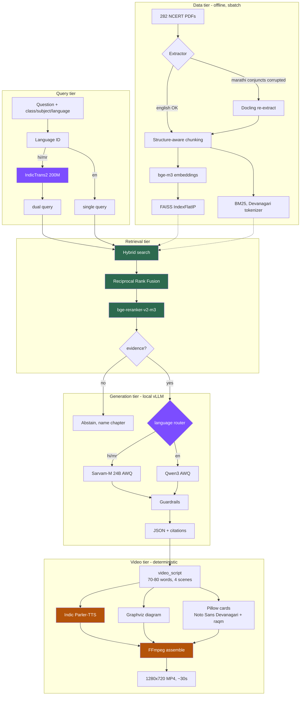

# plan.md — StoryTutor-MM: multilingual curriculum RAG + video, end to end

**Goal:** a fully open-source, GPU-accelerated, curriculum-grounded RAG tutor that
answers Class 6–8 Science / Social-Science questions from NCERT source text in
English, Hindi, and Marathi — and renders **2–3 explainer videos** as the final
research deliverable.

**Hard constraints**
- Every model OSI-open (Apache-2.0 / MIT). No exceptions without a recorded decision.
- **No third-party APIs. No API keys. No paid services anywhere in the runtime path.**
- Total cash cost: **$0** (see §9).

**Date:** 2026-09-23 · **Supersedes** the 2026-09-21 and earlier 2026-09-23 drafts.

---

## 0. Status

### Built and verified

| Component | Evidence |
| --- | --- |
| Corpus: 282 PDFs → 7,992 chunks | `ingestion_audit.json`, 0 errors, all 18 cells |
| FAISS index on GPU (bge-m3, 1024-dim) | built in **2:58** on A100-80GB |
| **Hybrid retrieval: dense + BM25 → RRF → cross-encoder** | API returns `retrieval_method: hybrid_rrf_rerank` |
| Citation-grounded prompt (`[S1]` markers) | shipped |
| Golden set: 268 questions, 50 reviewed | 60% keep — **en 89% / mr 45% / hi 36%** |
| Retrieval eval harness | written, **not yet run** |

### Not built
vLLM generation (queued), language-aware retrieval, TTS, video rendering,
guardrails, full RAG eval, corpus re-extraction.

### Unknown
**Whether retrieval works in Hindi and Marathi.** No non-English query has ever
been evaluated. Every Indic claim below is inference, not measurement.

---

## 1. What you must do manually

Everything else is automated. This is the complete list of human-only work.

| # | Task | When | Why only you can do it |
| --- | --- | --- | --- |
| 1 | `huggingface-cli login` | Before large downloads | **Optional.** All models are ungated — this only lifts anonymous rate limits. Token is free, `read` scope. Write it once; `HF_HOME` on `/scratch` shares it to every compute node. |
| 2 | Choose generator size | Before Phase D | `Qwen3-8B` queues faster; `Qwen3-14B` is stronger. For 3 videos, 8B is likely enough. |
| 3 | **Native-speaker check of 13 Indic golden items** | Before trusting Indic numbers | I reviewed them as an LLM proxy, not a fluent Marathi/Hindi speaker. The `keep_noisy` items need real eyes. |
| 4 | Pick the 2–3 video topics | Phase G | Research judgement — which questions best demonstrate the system. |
| 5 | Approve Docling re-ingest | After Phase A | Costs ~2 GPU-hours; only worth it if the eval says Marathi is broken. |

**API keys required: none.** Not one. `GROQ_API_KEY` and `SARVAM_API_KEY` exist in
the codebase as legacy optional paths and stay **unset** — that's what makes the
local vLLM server the primary provider.

---

## 2. Architecture



Green = running · Purple = language-aware additions · Amber = video tier

### Why language handling is three tiers, not one

| Tier | Failure it prevents | Cost |
| --- | --- | --- |
| **Data** (Docling) | Corrupted Devanagari makes every later stage read garbage | one-off |
| **Query** (IndicTrans2) | Thin native coverage returns nothing while a good English chunk sits unretrieved | ~1 GB |
| **Generation** (Sarvam-M) | A generalist writes stilted Hindi/Marathi | VRAM, AWQ only |

**A better Indic embedding model cannot rescue text corrupted at extraction.**
That's why Phase B precedes any embedding swap.

---

## 3. Model roster

Verify each licence on its model card before release.

### Running now

| Role | Model | Licence | Size |
| --- | --- | --- | --- |
| Embeddings | `BAAI/bge-m3` | MIT | 2.2 GB |
| Reranker | `BAAI/bge-reranker-v2-m3` | Apache-2.0 | 2.27 GB |
| Sparse | BM25 — in-repo, `story_mvp/bm25.py` | — | 0 |

### To add

| Role | Model | Licence | bf16 | AWQ | Phase |
| --- | --- | --- | --- | --- | --- |
| Generator (EN) | `Qwen/Qwen3-14B` or `Qwen3-8B` | Apache-2.0 | 28 / 16 GB | 9 / 5 GB | D |
| Generator (HI/MR) | `sarvamai/sarvam-m` 24B | Apache-2.0 | 48 GB | 14 GB | D |
| Query translation | `ai4bharat/indictrans2-indic-en-dist-200M` | MIT* | 1 GB | — | C |
| **TTS** | **`ai4bharat/indic-parler-tts`** | **Apache-2.0** | ~3 GB | — | G |
| Extraction | Docling | MIT | CPU | — | B |
| Groundedness | `vectara/hallucination_evaluation_model` | Apache-2.0 | 0.7 GB | — | E |
| Safety | `ibm-granite/granite-guardian-3.x` | Apache-2.0 | 5 GB | — | E |
| Eval judge | `Qwen/Qwen3-32B` | Apache-2.0 | 65 GB | 19 GB | F |

<sub>*AI4Bharat licences vary by artifact — confirm IndicTrans2's before release.</sub>

### TTS decision

**`ai4bharat/indic-parler-tts`** — Apache-2.0, 21 languages covering Hindi,
Marathi *and* Indian-accented English in **one model**, trained on 8,385 hours.
One model for all three target languages removes an entire routing layer.

Fallbacks, in order: `hexgrad/Kokoro-82M` (Apache-2.0, fast, weak Indic) →
`facebook/mms-tts-{hin,mar}` (**CC-BY-NC — research only, blocks any future
deployment; use only if the others fail**).

**Rejected:** Coqui XTTS-v2 (CPML, non-commercial).

### Rejected on licence
Llama 3.x / Llama Guard (Llama Community), Gemma 3 / ShieldGemma (Gemma Terms),
FLUX.1-dev (non-commercial), SD 3.5 (revenue-gated), `jina-embeddings-v3` (CC-BY-NC).

### Deliberately NOT used
**No image-generation model.** FLUX.1-schnell is Apache-2.0 and was in earlier
drafts, but for a 2–3 video research deliverable it is the wrong tool: 24 GB
download, GPU time, and *non-reproducible* output. Graphviz diagrams + Pillow
cards are deterministic, legible, CPU-only, and defensible in a paper.

---

## 4. Local servers

Three processes. All local, all open, none requiring credentials.

| Server | Command | Port | Purpose |
| --- | --- | --- | --- |
| **vLLM** | `sbatch slurm/serve_vllm.sbatch` | 8000 | OpenAI-compatible LLM endpoint on a GPU node |
| **Flask app** | `python -m story_mvp.app` | 5050 | RAG pipeline + `/api/generate` |
| Static demo | `node story_mvp/serve_static.js` | 5051 | Offline UI, no backend |

**Order matters.** vLLM must be `R` (not `PD`) before the app starts, and env vars
must be exported **before** launch — the app builds its provider chain at import,
so exporting afterwards silently does nothing. This has already bitten once.

```bash
# 1. wait for the server
squeue -u $USER                        # want ST = R
tail -f logs/vllm-*.out                # want "Uvicorn running"

# 2. THEN launch the app
cd $PROJ
export STORYTUTOR_ENABLE_RERANK=1
export VLLM_BASE_URL=$(cat slurm/vllm_endpoint.txt)
export VLLM_MODEL=Qwen/Qwen3-8B
python -m story_mvp.app
```

`serve_vllm.sbatch` writes its node:port to `slurm/vllm_endpoint.txt` and clears
it on exit, so a dead server can't leave a live-looking address behind.

---

## 5. API surface

**All internal. Zero third-party calls.**

| Endpoint | Method | Purpose |
| --- | --- | --- |
| `/api/generate` | POST | Full RAG pipeline → JSON + citations |
| `/api/health` | GET | `model_provider`, `engine`, embedding model |
| `/api/options` | GET | Valid enum values |
| `/api/demo` | GET | Canned demo payloads |
| `/api/video` *(Phase G)* | POST | Render MP4 from a generate response |

**Consumed locally:** vLLM `POST {VLLM_BASE_URL}/chat/completions`
(OpenAI-compatible, `Authorization: Bearer EMPTY` — no real key).

**Response contract is frozen.** Additive keys only; `test_ai_integration.py`
asserts the AI and deterministic paths return identical key sets.

---

## 6. Local → Sol workflow

Established and working. Code goes through GitHub; big data never does.

```bash
# on Windows
git add -A && git commit -m "..." && git push origin main

# on Sol
cd /scratch/$USER/storytutor && git pull
```

| Payload | Route |
| --- | --- |
| Code, docs, eval sets | **GitHub** (~1 MB) |
| `curriculum_chunks.json` | committed as `corpus.tar.gz` (4 MB) |
| 282 NCERT PDFs (2.5 GB) | Globus / `rsync` — only needed for Phase B |
| Model weights | downloaded on Sol into `HF_HOME=/scratch/$USER/hf_cache` |

**Never `git add` the PDFs.** `.gitignore` covers them; before that fix a plain
`git add -A` would have staged 294 files / 2.5 GB.

**Environments:** `storytutor` (app + retrieval) and `storytutor-vllm`
(server, isolated). Separate because vLLM pins torch tightly and would replace
the `torch 2.14.0+cu130` build the working retrieval stack runs on.

---

## 7. Phases

### A — Measure ← **do first, no LLM needed**
```bash
sbatch slurm/retrieval_eval.sbatch
```
`recall@{1,5,10}`, `chapter_hit@{1,5}`, MRR, empty-results — **sliced by
language**, run with and without the reranker. Caveat baked into the script:
`gold_chunk_ids` is the chunk each question was *extracted from*, not
necessarily the one holding its answer; read `chapter_hit@k` alongside.
**Exit:** baseline in `eval/reports/`.

### B — Corpus repair *(gated on A)*
Docling re-extraction, structure-aware chunking, drop chunks <200 chars
(today's minimum is **3 characters**). **Test on one Marathi PDF before
committing** — if Docling doesn't fix the conjunct corruption, fall back to
PyMuPDF or OCR. **Exit:** Marathi keep-rate materially above 45%.

### C — Language-aware retrieval
Language ID → IndicTrans2 `hi/mr → en` → retrieve both queries → RRF-fuse →
tag which query surfaced each source. **Exit:** Indic `recall@5` closes against English.

### D — Generation
vLLM + Qwen3 (AWQ). Add Sarvam-M and route by language **only if the A/B shows
it wins** on Hindi/Marathi. Honour `output_type` and `difficulty`, which today
reach the prompt and branch nothing. **Exit:** ≥95% parseable JSON; every
factual sentence cited.

### E — Guardrails
Input (scope, injection, PII) → retrieval (evidence gate) → output (HHEM
groundedness, citation enforcement, Granite Guardian, age-appropriateness).
Track benign false-positive rate — a guardrail that blocks real learners is its
own failure. **Exit:** 0 unsafe; benign FP <2%.

### F — Full RAG eval
RAGAS with **Qwen3-32B as a local judge** — no paid API in the eval loop. Plus
multilingual consistency: the same question in en/hi/mr should agree
semantically. **Exit:** faithfulness ≥0.85; per-language spread ≤10 points.

### G — Video *(the deliverable)*

| Scene | Time | Visual | Narration |
| --- | --- | --- | --- |
| 1 Title | 0–4 s | Title card + class/subject badge | ≤10 words |
| 2 Story | 4–14 s | Illustrated story card | ≤25 words |
| 3 Concept | 14–25 s | Animated Graphviz diagram | ≤28 words |
| 4 Check | 25–30 s | Quiz card | ≤12 words |

**Word budgets are load-bearing:** ~2.5 words/s English, ~2.2 Hindi/Marathi →
30 s ≈ **70–80 words total**. The current `narration_script` splices
`story[:280]` (~45 words for *one* scene) — that would produce a 60-second video.
Hence a new word-budgeted `video_script` field.

**Devanagari needs Pillow's `raqm` layout engine**, not just the right font, or
conjuncts render wrong. Test Hindi *and* Marathi explicitly.

**Exit:** 2–3 MP4s, 28–32 s, correct Devanagari in overlays and burned subtitles.

---

## 8. Decision gates

| If Phase A shows… | Then |
| --- | --- |
| Marathi recall ≪ English | Phase B is top priority |
| Low `recall@k`, high `chapter_hit@k` | Chunking problem — fix chunking, skip re-extraction |
| `empty_results` > 0 | Filter-negotiation bug — fix first |
| Rerank ≈ no-rerank | Cross-encoder isn't earning its cost |
| All three comparable | **Skip B and C** — go straight to D and G |

---

## 9. Cost

| Item | Cost |
| --- | --- |
| All model weights | **$0** — Apache-2.0 / MIT |
| Compute on Sol (~12 GPU-hrs for 2–3 videos) | **$0** |
| Storage (~60 GB of 100 TiB) | **$0** |
| APIs / keys | **$0** — none used |
| **Total** | **$0** |

For reference only: the same 12 GPU-hours rented would be ~$18 (A100 @ $1.49/hr),
and the same workload on a paid API at pilot scale would run ~$1,400–2,100/month.

**Your real constraint is queue time, not money.** For a 3-video scope use
`Qwen3-8B` on `--partition=public` (7-day limit) rather than `htc` (4-hour cap).

---

## 10. Risks

| Risk | Mitigation |
| --- | --- |
| Docling doesn't fix Marathi conjuncts | Test one PDF first; PyMuPDF/OCR fallback |
| Two-model routing exceeds VRAM | AWQ from the start — bf16 is 78 GB on an 80 GB card |
| Golden set is LLM-reviewed, not native-verified | Manual task #3 |
| Devanagari renders as boxes in video | Noto Sans Devanagari + raqm; test hi *and* mr |
| Narration overruns 30 s | Word budgets validated programmatically, not trusted |
| Queue waits block sessions | `public` partition; `sbatch` not interactive |
| Silent degradation | `model_provider` + `retrieval_method` in every response |

---

## 11. Definition of done

1. `git clone` + `sbatch` reproduces the system end to end.
2. Retrieval baseline published in `eval/reports/`, sliced by language.
3. `/api/generate` returns `model_provider: vllm` with `[S1]` citations.
4. **2–3 rendered MP4s** — at least one Hindi or Marathi — with correct Devanagari.
5. Zero paid API calls; every model Apache-2.0/MIT or a recorded exception.
6. `/api/generate` key set unchanged; full test suite green.

---

## 12. Next actions

```bash
cd $PROJ && git pull

# 1. the measurement that gates everything (no LLM needed)
sbatch slurm/retrieval_eval.sbatch

# 2. generation, on the long-limit partition
sbatch --partition=public --qos=public --time=1-00:00:00 \
       --export=ALL,VLLM_MODEL=Qwen/Qwen3-8B slurm/serve_vllm.sbatch
```

**Sources for model/pricing claims:**
[Indic Parler-TTS](https://huggingface.co/ai4bharat/indic-parler-tts-pretrained) ·
[AI4Bharat TTS](https://ai4bharat.iitm.ac.in/areas/model/TTS/Indic%20Parler%20TTS/) ·
[GPU pricing 2026](https://www.spheron.network/blog/runpod-vs-lambda-labs-2026/) ·
[API pricing 2026](https://intuitionlabs.ai/articles/ai-api-pricing-comparison-grok-gemini-openai-claude)
