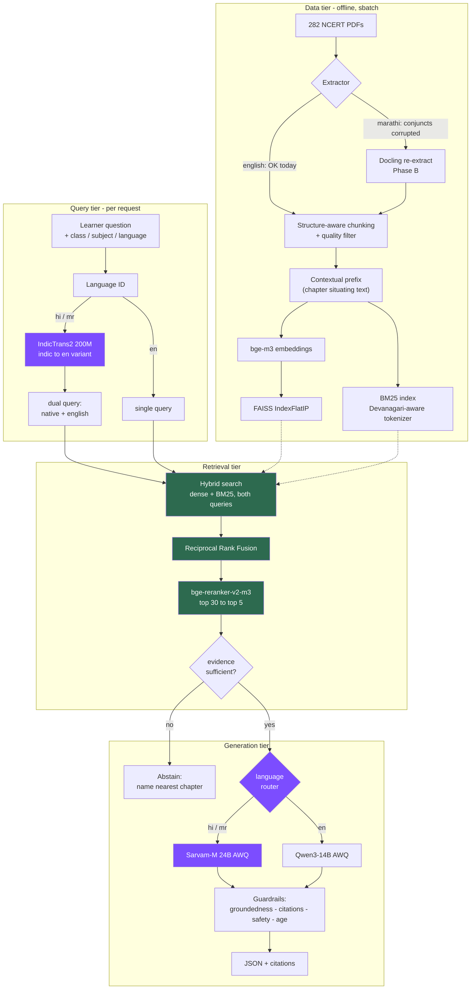

# plan.md — StoryTutor-MM: language-aware curriculum RAG on ASU Sol

**Target:** a fully open-source, GPU-accelerated, curriculum-grounded RAG tutor
answering Class 6–8 Science / Social-Science questions from NCERT source text in
English, Hindi, and Marathi — with per-language quality that is *measured*, not
assumed.

**Hard constraint:** every model OSI-open (Apache-2.0 / MIT) or explicitly noted.
No paid APIs in the runtime path.

**Supersedes:** the 2026-09-21 plan, which was written before anything was built.
This one is grounded in what actually shipped and what the data now shows.

**Date:** 2026-09-23

---

## 0. Where we actually are

### Built and verified running

| Component | Evidence |
| --- | --- |
| Corpus: 282 PDFs → 7,992 chunks, 9.9 M chars | `ingestion_audit.json`, 0 errors, all 18 class×subject×language cells |
| FAISS index on GPU (bge-m3, 1024-dim) | built in **2:58** on an A100-80GB via `sbatch` |
| **Hybrid retrieval: dense + BM25 → RRF → cross-encoder** | live; API returns `retrieval_method: hybrid_rrf_rerank` |
| Citation-grounded prompt (`[S1]` markers) | shipped in `build_tutor_system_prompt` |
| Golden set: 268 questions from NCERT exercises | `eval/golden/golden_set.jsonl` |
| Human-proxy review of 50 | 60% keep — **en 89% / mr 45% / hi 36%** |
| Per-language retrieval eval harness | `eval/run_retrieval_eval.py` — **written, not yet run** |

### Not built

vLLM generation (queued), language-aware retrieval, Indic generation routing,
guardrails, full RAG eval, corpus re-extraction, video rendering, production serving.

### The one thing we do not know

**Whether retrieval actually works in Hindi and Marathi.** Not one non-English
query has been evaluated. Every claim below about Indic quality is inference
from corpus-quality data, not measurement. Phase A exists to end that.

---

## 1. Principles

1. **Measure before adding models.** A new model on a broken corpus hides the
   corpus problem behind more complexity.
2. **Open weights only.** Apache-2.0/MIT preferred; exceptions recorded in §3.
3. **The API contract stays frozen.** `/api/generate` keys are additive-only;
   `test_ai_integration.py` asserts AI and fallback return identical key sets.
4. **Nothing heavy at import time.** Index building and model serving are
   `sbatch` jobs.
5. **Every claim cited.** Unsupported by retrieved context → abstain, don't guess.
6. **Degrade loudly, not silently.** Four fallback layers mean the app never
   errors; `model_provider` and `retrieval_method` must always say what really ran.

---

## 2. Target architecture



Green = built and running. Purple = the language-aware additions this plan introduces.

### Why three separate language tiers

Language handling is not one decision, it's three, and they fail differently:

| Tier | Failure it prevents | Cost |
| --- | --- | --- |
| **Data** (Docling) | Corrupted Devanagari makes every downstream stage read garbage | One-off re-ingest |
| **Query** (IndicTrans2) | Thin native-language coverage returns nothing, while a good English chunk sits unretrieved | ~1 GB, ~50 ms/query |
| **Generation** (Sarvam-M) | A multilingual generalist writes stilted, unidiomatic Hindi/Marathi | VRAM, only if AWQ |

Fixing the wrong tier is the main risk: **a better Indic embedding model cannot
rescue text that was corrupted at extraction.**

---

## 3. Model roster

Verify every licence on its model card before shipping — licences change.

### Running now

| Role | Model | Licence | VRAM |
| --- | --- | --- | --- |
| Embeddings | `BAAI/bge-m3` | MIT | ~2.5 GB |
| Reranker | `BAAI/bge-reranker-v2-m3` | Apache-2.0 | ~2.5 GB |
| Sparse | BM25 (in-repo, `story_mvp/bm25.py`) | — | 0 |

### This plan adds

| Role | Model | Licence | VRAM | Phase |
| --- | --- | --- | --- | --- |
| Extraction | Docling | MIT | CPU | B |
| Query translation | `ai4bharat/indictrans2-indic-en-dist-200M` | MIT* | ~1 GB | C |
| Generator (en) | `Qwen/Qwen3-14B` — AWQ 4-bit | Apache-2.0 | ~9 GB | D |
| Generator (hi/mr) | `sarvamai/sarvam-m` 24B — AWQ 4-bit | Apache-2.0 | ~14 GB | D |
| Groundedness | `vectara/hallucination_evaluation_model` | Apache-2.0 | <1 GB | E |
| Safety | `ibm-granite/granite-guardian-3.x` | Apache-2.0 | ~5 GB | E |
| Eval judge | `Qwen/Qwen3-32B` | Apache-2.0 | ~18 GB AWQ | F |

<sub>*AI4Bharat licences vary by artifact — confirm before release.</sub>

### Contingency (only if Phase A/C data justifies it)

`l3cube-pune/marathi-sentence-similarity-sbert`, `l3cube-pune/hindi-sentence-similarity-sbert`,
`google/muril-base-cased` (Apache-2.0) as an embedding A/B — **only** if bge-m3
measurably underperforms on Indic *after* the corpus is clean. Swapping
embeddings before Phase B would measure extraction damage, not model quality.

### Rejected on licence

Llama 3.x / Llama Guard 3 (Llama Community), Gemma 3 / ShieldGemma (Gemma Terms),
FLUX.1-dev (non-commercial), SD 3.5 (revenue-gated), XTTS-v2 (CPML),
`facebook/mms-tts-*` (CC-BY-NC), `jinaai/jina-embeddings-v3` (CC-BY-NC).

---

## 4. VRAM budget — A100 80 GB

| Config | Fits? |
| --- | --- |
| Qwen3-14B bf16 (30) + Sarvam-M bf16 (48) | ❌ 78 GB, no KV headroom |
| Qwen3-14B AWQ (9) + Sarvam-M AWQ (14) | ✅ ~23 GB + KV, comfortable |
| Either AWQ + bge-m3 (2.5) + reranker (2.5) + IndicTrans2 (1) | ✅ single node end-to-end |

**Two-model routing is only viable quantized.** Design around AWQ from the start
rather than discovering this at deployment.

---

## 5. Phases

### Phase A — Measure (no LLM, no blockers) ← **do first**

```bash
sbatch slurm/retrieval_eval.sbatch
```

Runs `eval/run_retrieval_eval.py` twice, with and without the reranker, over the
golden set. Reports `recall@{1,5,10}`, `chapter_hit@{1,5}`, MRR, empty-result
counts — **sliced by language**.

**Caveat baked into the script:** `gold_chunk_ids` is the chunk each question was
*extracted from*, not necessarily the chunk holding its answer. Read
`chapter_hit@k` alongside `recall@k`.

**Exit:** a published baseline in `eval/reports/`. Everything after this is
judged against it.

### Phase B — Corpus repair *(gated on A)*

Docling re-extraction with structure-aware chunking, quality filters (drop
<200 chars — today's minimum chunk is **3 characters**), and contextual prefixes.

**Critical unknown:** whether Docling fixes the Marathi conjunct corruption.
Test it on **one** Marathi PDF before committing to a full re-ingest. If it
doesn't, fall back to PyMuPDF or an OCR path.

**Exit:** Marathi keep-rate on a re-extracted golden sample materially above 45%.

### Phase C — Language-aware retrieval

1. Language ID on the incoming query.
2. IndicTrans2 `hi/mr → en` variant.
3. Retrieve with **both** queries; RRF-fuse the two result sets.
4. Tag each source with which query surfaced it.

Cheap (~1 GB, ~50 ms) and directly addresses uneven per-language coverage.

**Exit:** Indic `recall@5` closes measurably against English vs the Phase A baseline.

### Phase D — Language-routed generation

1. Stand up vLLM with AWQ Qwen3-14B (in flight).
2. Add Sarvam-M AWQ as a second served model.
3. Route by request language; keep the provider chain's fallbacks intact.
4. **A/B both models on Hindi and Marathi** against the golden set — route on
   data, not assumption.
5. Honour `output_type` and `difficulty`, which today reach the prompt and
   branch nothing.

**Exit:** ≥95% first-attempt parseable JSON; 100% of factual sentences carry a
citation marker.

### Phase E — Guardrails

Input (syllabus scope, injection, PII) → retrieval (evidence gate, source
diversity) → output (HHEM groundedness, citation enforcement, Granite Guardian,
age-appropriateness) → product (no external links, pedagogical refusals, logged
abstentions).

Red-team set ~100 prompts. Track attack success **and** benign false-positive
rate — a guardrail that blocks real learners is its own failure.

**Exit:** 0 unsafe outputs; benign false positives <2%.

### Phase F — Full RAG eval

RAGAS (faithfulness, answer relevancy, context precision/recall) with Qwen3-32B
as a **local** judge — no paid API in the eval loop. Plus HHEM groundedness,
curriculum correctness, and multilingual consistency (same question in en/hi/mr
should agree semantically).

**Exit:** faithfulness ≥0.85; per-language spread ≤10 points.

### Phase G — Video *(explicitly deferred)*

30-second explainer: word-budgeted `video_script` (≈70–80 words total),
Indic Parler-TTS, Graphviz diagrams from the existing `diagram_plan`, Pillow +
Noto Sans Devanagari with the **raqm** layout engine, FFmpeg assembly.
Deterministic rendering, not text-to-video diffusion — the text *is* the payload.

### Phase H — Serving

Prebuilt index artifacts, real readiness endpoint, structured logging, degradation
surfaced in the UI, and a frontend that renders the storyboard/quiz/diagram/
citations it already receives instead of collapsing them into `<li>` lines.

---

## 6. Decision gates

Evidence-driven, so phases aren't run on faith:

| If Phase A shows… | Then |
| --- | --- |
| Marathi recall ≪ English | Phase B is the top priority, not optional |
| Low `recall@k`, high `chapter_hit@k` | Chunking problem → Phase B chunking, skip re-extraction |
| `empty_results` > 0 | Filter-negotiation bug → fix before anything else |
| Rerank ≈ no-rerank | Cross-encoder isn't earning its cost — drop or re-tune |
| All three languages comparable | Skip straight to Phase D; the Indic worry was unfounded |

---

## 7. Risks

| Risk | Mitigation |
| --- | --- |
| Docling doesn't fix Marathi conjuncts | Test one PDF first; PyMuPDF/OCR fallback |
| Two-model routing exceeds VRAM | AWQ from the start (§4) |
| Golden set is LLM-reviewed, not native-speaker verified | Fluent pass on the 13 `keep_noisy` Indic items before trusting Indic numbers |
| `recall@k` measures the wrong thing | `chapter_hit@k` reported alongside |
| Adding models masks data problems | Phase ordering + decision gates |
| htc 4h cap kills long jobs | `--partition=public` for anything longer |
| Silent degradation | `model_provider` + `retrieval_method` in every response |

---

## 8. Definition of done

1. `git clone` + `sbatch` reproduces the system end to end.
2. Baseline and post-change scorecards published in `eval/reports/`.
3. Retrieval: `recall@5` ≥0.85, per-language spread ≤10 points.
4. Generation: faithfulness ≥0.85; every answer cited or explicitly abstained.
5. Guardrails: 0 unsafe on red-team; benign false positives <2%.
6. **A Hindi and a Marathi question answered as well as an English one — proven
   by numbers, not by inspection of one example.**
7. Zero paid API calls anywhere in the runtime path.
8. `/api/generate` key set unchanged; full test suite green.

---

## 9. Immediate next actions

```bash
cd $PROJ && git pull

# 1. the measurement that unblocks every decision above
sbatch slurm/retrieval_eval.sbatch

# 2. when the vLLM job reaches R (exports BEFORE launch)
export STORYTUTOR_ENABLE_RERANK=1
export VLLM_BASE_URL=$(cat slurm/vllm_endpoint.txt)
export VLLM_MODEL=Qwen/Qwen3-14B
python -m story_mvp.app
```

Phase A is the gate. Until it runs, any further model work is guesswork.
