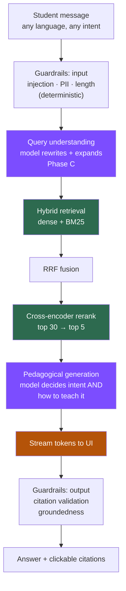

# plan.md — StoryTutor-MM: a curriculum RAG tutor that teaches well

**Product:** a multilingual chatbot that answers NCERT Class 6–8 Science and
Social-Science questions from the real textbooks, in English, Hindi or Marathi —
**fast enough to feel instant, and explained well enough to actually teach.**

**Hard constraints**
- Every model OSI-open (Apache-2.0 / MIT). No paid APIs. No API keys. **$0.**
- **No rule engines in the reasoning path.** Pattern lists go in guardrails only,
  where determinism is the point; everything else is the model's judgement.
- Every factual claim cites a real retrieved page, or the system says it doesn't know.

**Date:** 2026-09-24 · supersedes all earlier plans.

---

## 0. Where we are

### Working and measured

| Component | Evidence |
| --- | --- |
| Corpus: 282 PDFs → 7,086 chunks | 0 errors, all 18 class×subject×language cells |
| **Devanagari repair** | damage median: hindi 100.7→**10.9**, marathi 72.7→**9.1** |
| Glyph intruders removed | **34,985 → 98** |
| FAISS index on GPU | 7,126 vectors, built in 2:58 on A100 |
| **Hybrid retrieval** dense+BM25→RRF→cross-encoder | live; `hybrid_rrf_rerank`, top score **0.956** |
| Hindi + Marathi retrieval | **verified working** — correct chapters and pages |
| Guardrails | injection, PII redaction, invented-citation stripping, groundedness |
| Chat UI | React, citations clickable, pipeline visible |
| Tests | **88 passing** |

### Not working yet

**No LLM has ever run.** Every vLLM job died on environment setup; Ollama is
installed but unproven. So generation has never been exercised — the system has
only ever returned raw passages.

### The two gaps this plan closes

1. **It doesn't teach.** The current prompt optimises for groundedness and
   produces textbook regurgitation. A student who didn't understand the book
   will not understand a paraphrase of the book.
2. **It doesn't feel instant.** A full answer takes 5–10s with nothing on
   screen until it's done.

---

## 1. Principles

1. **Intelligence, not rules.** The model routes, interprets and explains.
   Deterministic logic is confined to guardrails, where being un-negotiable is
   the whole point — a prompt-injection check must not be arguable.
2. **Cite facts, own the pedagogy.** A retrieved fact needs `[S1]`. An analogy,
   a framing, an everyday example is the model's own contribution and needs no
   citation — it must simply not contradict the sources. Conflating these is
   what produces dry, uncitable-therefore-omitted explanation.
3. **Stream everything.** Perceived latency is the product.
4. **Refuse rather than guess.** Out of syllabus → say so, name the nearest chapter.
5. **Degrade loudly.** `model_provider` and `retrieval_method` in every response.
6. **Measure teaching, not just retrieval.** Recall@5 says nothing about whether
   a 12-year-old understood.

---

## 2. Architecture



Green = built · Purple = intelligence upgrades · Amber = latency

**No intent classifier in this diagram.** Retrieval runs on every message
(~50 ms) and the generation prompt decides whether the passages are relevant.
That handles mixed intent — *"hi, explain photosynthesis"* — which no router
splits cleanly. A semantic classifier exists **only** as the no-LLM fallback.

---

## 3. The answer-quality problem

This is the core of this plan, and it is a prompt-and-eval problem, not an
infrastructure one.

### What's wrong now

The prompt says *"answer from the sources, cite every factual sentence, 2–4
paragraphs, no invented scenarios."* Optimised for not-hallucinating. The
predictable result is a citation-studded paraphrase of the textbook — which is
exactly what the student already failed to understand.

### The fix: separate facts from pedagogy

| Layer | Source | Citation | Example |
| --- | --- | --- | --- |
| **Fact** | retrieved passage only | **required** `[S1]` | "Heat moves from the hotter object to the cooler one [S1]." |
| **Intuition** | model's own | none | "Think of heat as always rolling downhill." |
| **Analogy** | model's own | none | "Like a crowded room emptying into an empty one." |
| **Example** | model's own, everyday | none | "That's why a steel spoon in chai gets hot but the plastic handle doesn't." |
| **Check** | model's own | none | "So what would happen with a wooden spoon?" |

The rule that keeps this safe: **an analogy is not a factual claim.** It needs
no source, but it must not contradict one. This is what lets the model be
genuinely explanatory without inventing curriculum content.

### Answer shape

1. Direct answer in one or two sentences — the student asked something, answer it
2. The mechanism, grounded and cited
3. An intuition or analogy that makes it click
4. One everyday Indian example (chai, monsoon, bicycle, cricket)
5. Optionally, one short check question

Pitched by class: Class 6 gets shorter sentences and more concrete anchors than
Class 8.

### What stays forbidden

Inventing facts, inventing citations, contradicting the sources, answering
out-of-syllabus questions from general knowledge, fictional characters and
dialogue (that was the old story-generator failure mode).

---

## 4. Latency

Target: **first token under 1 second**, full answer under 8.

| Stage | Budget | Now |
| --- | --- | --- |
| Guardrails | <5 ms | ✅ |
| Retrieval (dense + BM25 + RRF) | <100 ms | ✅ |
| Rerank (30 candidates, GPU) | <150 ms | ✅ |
| **First token** | **<1 s** | ❌ not streaming |
| Full answer | <8 s | unknown |

**Streaming is the whole fix.** Total generation time barely changes; what
changes is that the student sees words immediately instead of a spinner. Server-
sent events from Flask, incremental render in React.

Per-stage timings go into every response so this is measured, not assumed.

---

## 5. Model roster

| Role | Model | Licence | Notes |
| --- | --- | --- | --- |
| Embeddings | `BAAI/bge-m3` | MIT | ✅ running |
| Reranker | `BAAI/bge-reranker-v2-m3` | Apache-2.0 | ✅ running |
| Sparse | BM25, in-repo | — | ✅ Devanagari-aware |
| **Generator** | `qwen3:8b` via **Ollama** | Apache-2.0 | GGUF ~5 GB |
| Generator (bigger) | `qwen3:14b` | Apache-2.0 | if 8b under-explains |
| Generator (Indic A/B) | `sarvam-m` 24B | Apache-2.0 | only if evals justify it |

**Ollama over vLLM**, decided by experience: vLLM failed on environment setup
every single attempt because it pins torch and needs its own conda env. Ollama
is one static binary, GGUF weights are ~3× smaller, `OllamaClient` already
existed, and it binds `127.0.0.1` on the same node as Flask — no endpoint file,
no cross-node discovery.

---

## 6. Phases

### A — Generation quality *(the point of this plan)*
Rewrite `build_chat_prompt` around §3: fact/pedagogy separation, the five-part
answer shape, class-appropriate pitch. Keep every grounding rule.
**Exit:** side-by-side answers are explanatory, not paraphrase; citations still
100% valid.

### B — Streaming
`POST /api/chat/stream` (SSE) + incremental React render. Ollama and the
OpenAI-compatible providers both support token streaming.
**Exit:** first token <1 s measured.

### C — Query understanding
Before retrieval, the model rewrites the question: resolve pronouns against
history ("why?"), expand abbreviations, and for Hindi/Marathi also emit an
English variant so both get searched and RRF-fused. Model-driven, no rules.
**Exit:** Indic recall@5 closes on English.

### D — Teaching evals
Beyond retrieval metrics: explanation depth (does it go past the passage?),
analogy presence, readability for the class level, citation validity,
groundedness. Judged locally by `qwen3:14b`, a different model than the one
generating, to limit self-preference.
**Exit:** baseline scorecard in `eval/reports/`.

### E — Adaptive follow-up
Use conversation history so "explain it more simply" or "why?" works without
re-asking. Partly built (history is already passed).

---

## 7. Run sequence

```bash
cd $PROJ && git pull
tar -xzf corpus.tar.gz
sbatch --partition=htc --qos=public slurm/build_index.sbatch   # corpus changed

bash scripts/setup_ollama.sh          # rootless, ~5 GB, no queue wait
export PATH=/scratch/$USER/ollama/bin:$PATH
export OLLAMA_HOST=http://127.0.0.1:11434
export OLLAMA_MODEL=qwen3:8b
export STORYTUTOR_ENABLE_RERANK=1
python -m story_mvp.app
```

Ollama must run on the **same node** as Flask — it binds `127.0.0.1`.

---

## 8. Definition of done

1. A Class 7 student asking a Marathi science question gets a **Marathi
   explanation with an analogy**, cited to a real page, first token in <1 s.
2. "hi" gets a warm greeting; an out-of-syllabus question gets an honest refusal.
3. Citation validity 100% — zero invented markers reach the user.
4. Teaching-quality scorecard published, sliced by language.
5. Zero paid API calls. Every model Apache-2.0/MIT.
6. Full test suite green.

---

## 9. Honest status

The retrieval half is **built, measured, and working in all three languages** —
that was the hard part and it is done. The generation half has **never run
once**. Everything in §3 is a design, not a result, until an LLM is serving and
§6D has produced numbers.
